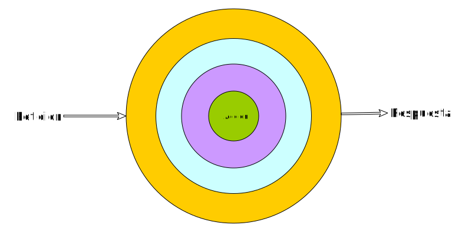

# Middleware

Yii works with HTTP using abstraction layer built around [PSR-7 HTTP message interfaces](https://www.php-fig.org/psr/psr-7/)
and [PSR-15 request handler/middleware interfaces](https://www.php-fig.org/psr/psr-15/).

The application is composed from one or several middleware. When the URL is requested, the request object is passed to
the middleware dispatcher that executes middleware from the stack one by one. Each middleware, given the request, can
either return a response or pass execution to the next middleware.



Depending on how stack is configured, application behavior may vary significantly.

## Using middleware

Any PSR-15 compatible middleware could be used with Yii and there are many. Say, we need to add basic authentication
one of the application URLs. URL-dependent middeware are configured using router, so we need to modify router factory.

Authentication middleware is implemented by `middlewares/http-authentication` package so execute
`composer require middlewares/http-authentication` in the application root directory.

Now register the middleware in DI container configuration `config/web.php`:

```php
\Middlewares\BasicAuthentication::class => [
    '__class' => \Middlewares\BasicAuthentication::class,
    '__construct()' => [
        'users' => [
            'foo' => 'bar',
        ],
    ],
    'realm()' => ['Access to the staging site via basic auth'],
    'attribute()' => ['username'],
],
```

In the router factory, `src/Factory/AppRouterFactory.php` modify the route:

```php
use Yiisoft\Router\FastRoute\UrlMatcher;
use Yiisoft\Router\Group;
use Yiisoft\Router\Route;
use Yiisoft\Router\RouteCollection;
use Yiisoft\Router\RouteCollectorInterface;

// ...
class AppRouterFactory
{
    public function __invoke(ContainerInterface $container)
    {
         $basicAuth = $container->get(\Middlewares\BasicAuthentication::class);

         $routes = [
            // ...
            Route::get('/basic-auth', [SiteController::class, 'auth'])->addMiddleware($basicAuth),
        ];

        $collector =  $container->get(RouteCollectorInterface::class);
        $collector->addGroup(Group::create(null, $routes));

        return new UrlMatcher(new RouteCollection($collector));
    }
}
```

In the above when configuring routing, we are binding `/basic-auth` URL to a chain of middeware consisting of basic
authentication and the action itself. A chain is a special middleware that executes all the middleware it is configured
with.

The action itself may be the following:

```php
public function auth(ServerRequestInterface $request): ResponseInterface
{
    $response = $this->responseFactory->createResponse();
    $response->getBody()->write('Hi ' . $request->getAttribute('username'));
    return $response;
}
```

Basic authentication middleware wrote to request `username` attribute so we can access the data if needed.

To apply middleware to application overall regardless of URL, adjust `src/Factory/MiddlewareDispatcherFactory.php`:

```php
use Psr\Container\ContainerInterface;
use Yiisoft\Router\Middleware\Router;
use Yiisoft\Yii\Web\ErrorHandler\ErrorCatcher;
use Yiisoft\Yii\Web\Middleware\SubFolder;
use Yiisoft\Yii\Web\MiddlewareDispatcher;
use Yiisoft\Yii\Web\Session\SessionMiddleware;

class MiddlewareDispatcherFactory
{
    public function __invoke(ContainerInterface $container)
    {
        $session = $container->get(SessionMiddleware::class);
        $router = $container->get(Router::class);
        $errorCatcher = $container->get(ErrorCatcher::class);
        $subFolder = $container->get(SubFolder::class);
        $basicAuth = $container->get(\Middlewares\BasicAuthentication::class);

        return (new MiddlewareDispatcher($container))
            ->addMiddleware($router)
            ->addMiddleware($subFolder)
            ->addMiddleware($session)
            ->addMiddleware($basicAuth)
            ->addMiddleware($errorCatcher);
    }
}
```

## Creating your own middleware

To create a middleware you need to implement a single `process` method of `Psr\Http\Server\MiddlewareInterface`:

```php
public function process(ServerRequestInterface $request, RequestHandlerInterface $next): ResponseInterface;
```

There are multiple ways to handle request and choosing one depends on what the middleware should achieve.

### Forming response directly

To respond directly one needs a response factory passed via constructor:

```php
use Psr\Http\Message\ResponseFactoryInterface;
use Psr\Http\Message\ResponseInterface;
use Psr\Http\Message\ServerRequestInterface;
use Psr\Http\Server\MiddlewareInterface;
use Psr\Http\Server\RequestHandlerInterface;

class RespondingMiddleware implements MiddlewareInterface
{
    private ResponseFactoryInterface $responseFactory;

    public function __construct(ResponseFactoryInterface $responseFactory)
    {
        $this->responseFactory = $responseFactory;
    }

    public function process(ServerRequestInterface $request, RequestHandlerInterface $next): ResponseInterface
    {
        $response = $this->responseFactory->createResponse();
        $response->getBody()->write('Hello!');
        return $response;
    }
}
```

### Delegating handling to the next middleware

If middleware either is not intended form response / modify request or cannot do it this time, handling could be
left to next middleware in the stack:  

```php
return $next->handle($request);
```

### Capturing response to manipulate it

You may want to capture response to manipulate it. It could be useful for adding CORS headers, gzipping content etc.

```php
$response = $next->handle($request);
// extra handing
return $response;
```
