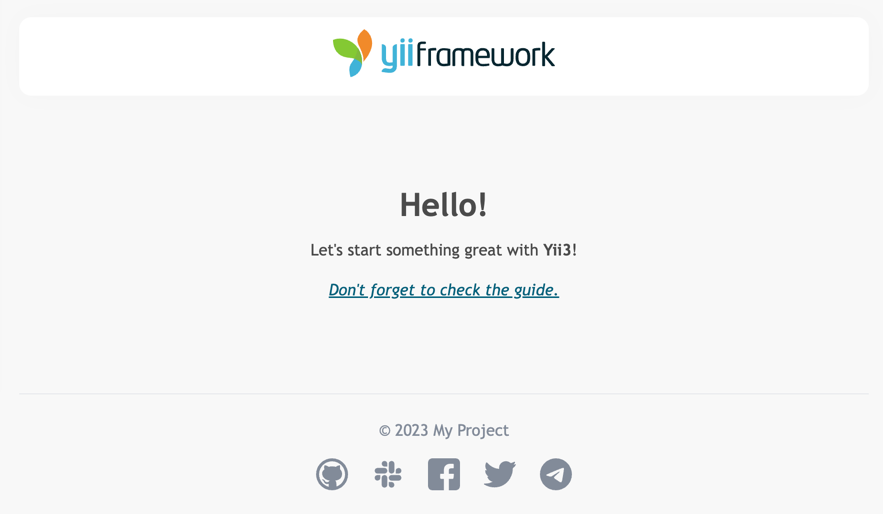

# Creating a project

We recommend starting with a project template that's a minimal working Yii project implementing some basic features.
It can serve as a good starting point for your projects.

You can create a new project from a template using the [Composer](https://getcomposer.org) package manager.

Since we're going to use Docker overall, you need to [install it first](https://docs.docker.com/get-started/get-docker/).

Then run the following command:

```sh
docker run --rm -it -v "$(pwd):/app" composer/composer create-project yiisoft/app your_project
```

This installs the latest stable version of the Yii project template in a directory named `your_project`.
You can choose a different directory name if you want.

> [!IMPORTANT]
> If you want to install the latest development version of Yii, you may use the following command instead,
> which adds a [stability option](https://getcomposer.org/doc/04-schema.md#minimum-stability):
>
> ```bash
> docker run --rm -it -v "$(pwd):/app" composer/composer create-project --stability=dev yiisoft/app your_project
> ```


> [!NOTE]
> Don't use the development version of Yii for production because it may break your running code.

After you finish installation, run `make up` and open your browser to the URL `http://localhost/`.

> [!NOTE]
> By default, the HTTP server listens on port 80. If that port is already in use, or you want to 
> serve many applications this way, specify the port via `DEV_PORT` in the `docker/.env` file.


