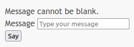
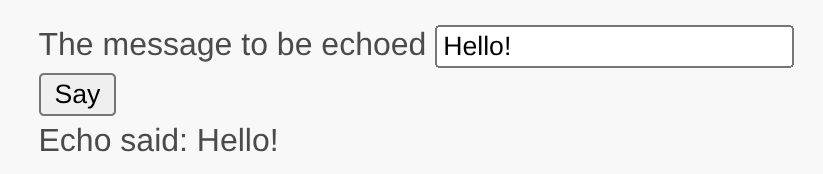

# Working with Forms

This section continues to improve on "Saying Hello". Instead of using URL we will now ask user for a message via form.

Through this tutorial, you will learn how to:

* Create a form model to represent the data entered by a user through a form.
* Declare rules to validate the data entered.
* Build an HTML form in a view.

## Installing form package

In order to install form package, issue the following command in your application directory:

```
composer require yiisoft/form
```

## Creating a form <span id="creating-form"></span>

The data to be requested from the user will be represented by an `EchoForm` class as shown below and
saved in the file `/src/Form/EchoForm.php`:

```php
<?php
namespace App\Form;

use Yiisoft\Form\FormModel;

class EchoForm extends FormModel
{
    private string $message = '';

    public function getMessage(): string
    {
        return $this->message;
    }

    public function attributeLabels(): array
    {
        return [
            'message' => 'Message',
        ];
    }
}
```

The class extends from a base class provided by Yii, commonly used to
represent form data.

The `EchoForm` class contains `$message` property and related getter. These are regular data-related code.
`attributeLabels()` method provides labels that we are going to display in a view.

## Using the form <span id="using-form"></span> 

Now, that we have a form, let's use it in our action from "[Saying Hello](hello.md)". Here's what we end up with in
`/src/Controller/EchoController.php`:

```php
<?php

declare(strict_types=1);

namespace App\Controller;

use App\Form\EchoForm;
use App\ViewRenderer;
use Psr\Http\Message\ResponseInterface;
use Psr\Http\Message\ServerRequestInterface;
use Yiisoft\Http\Method;

class EchoController
{
    private ViewRenderer $viewRenderer;

    public function __construct(ViewRenderer $viewRenderer)
    {
        $this->viewRenderer = $viewRenderer->withControllerName('echo');
    }

    public function say(ServerRequestInterface $request, EchoForm $form): ResponseInterface
    {
        if ($request->getMethod() === Method::POST) {
            $form->load($request->getParsedBody());
        }

        return $this->viewRenderer->withCsrf()->render('say', [
            'form' => $form,
        ]);
    }
}
```

Instead of reading from request directly we fill our form with the help of `load()` method if the request
method is POST and then pass it to our view. Since we are going to submit the form via POST method, we add CSRF
protection token to ensure that the request originates from the form page and not from another website.
Omitting it would result in [HTTP response code 422](https://tools.ietf.org/html/rfc4918#section-11.2).

Additionally, to allow POST, we need to adjust our route in `config/routes.php`:

```php
<?php

declare(strict_types=1);

use App\Contact\ContactController;
use App\Controller\EchoController;
use App\Controller\SiteController;
use Yiisoft\Http\Method;
use Yiisoft\Router\Route;

return [
    Route::get('/', [SiteController::class, 'index'])->name('site/index'),
        Route::get('/about', [SiteController::class, 'about'])->name('site/about'),
        Route::methods([Method::GET, Method::POST], '/contact', [ContactController::class, 'contact'])
            ->name('contact/form'),
    Route::methods([Method::GET, Method::POST], '/say', [EchoController::class, 'say'])->name('echo/say'),
];
```

## Adjusting view

In order to render a form we need to modify our view, `resources/views/echo/say.php`:

```php
<?php

use Yiisoft\Form\Widget\Field;
use Yiisoft\Form\Widget\Form;
use Yiisoft\Html\Html;

/* @var \App\Form\EchoForm $form */
/* @var string $csrf */
/* @var \Yiisoft\Router\UrlGeneratorInterface $url */
?>


<?php if (!empty($form->getMessage())): ?>
<div class="notification is-success">
    The message is: <?= Html::encode($form->getMessage()) ?>
</div>
<?php endif ?>

<?= Form::begin()->action($url->generate('echo/say'))->start() ?>

<?= Html::hiddenInput('_csrf', $csrf) ?>

<?= Field::widget()->config($form, 'message') ?>

<?= Html::submitButton('Say') ?>

<?= Form::end() ?>
```

If form has a message set, we are displaying a box with the message. The rest if about rendering the form.

We get the action URL from URL manager service. We access it as `$url` that is a default parameter available in all views.
It is configured in `config/params.php`:

```php
'yiisoft/view' => [
    'defaultParameters' => [
        'applicationParameters' => ApplicationParameters::class,
        'assetManager' => AssetManager::class,
        'field' => Field::class,
        'url' => UrlGeneratorInterface::class,
        'urlMatcher' => UrlMatcherInterface::class,
    ],
],
```

We render the value of CSRF token as a hidden input. It will be submitted along with POST form data.

We use `Field` to output "message" field, so it takes case about filling the value, escaping it, rendering field label
and validation errors we are going to take care of next. 

## Adding validation

Right now it is possible to submit empty value. Let's make it required. Modify `/src/Controller/EchoController.php`:

```php
<?php

declare(strict_types=1);

namespace App\Controller;

use App\Form\EchoForm;
use App\ViewRenderer;
use Psr\Http\Message\ResponseInterface;
use Psr\Http\Message\ServerRequestInterface;
use Yiisoft\Http\Method;

class EchoController
{
    private ViewRenderer $viewRenderer;

    public function __construct(ViewRenderer $viewRenderer)
    {
        $this->viewRenderer = $viewRenderer->withControllerName('echo');
    }

    public function say(ServerRequestInterface $request, EchoForm $form): ResponseInterface
    {
        if ($request->getMethod() === Method::POST) {
            $form->load($request->getParsedBody());
            $form->validate();
        }

        return $this->viewRenderer->withCsrf()->render('say', [
            'form' => $form,
        ]);
    }
}
```

The only line we have added is `$form->validate();` that triggers validation of the form. Now we need to add validation
rules to `/src/Form/EchoForm.php`:

```php
<?php
namespace App\Form;

use Yiisoft\Form\FormModel;
use Yiisoft\Validator\Rule\Required;

class EchoForm extends FormModel
{
    private string $message = '';

    public function getMessage(): string
    {
        return $this->message;
    }

    public function attributeLabels(): array
    {
        return [
            'message' => 'Message',
        ];
    }

    protected function rules(): array
    {
        return [
            'message' => [
                new Required()
            ]
        ];
    }
}
```

Now in case you will submit empty message you will get a validation error: "Value cannot be blank."

## Trying it Out <span id="trying-it-out"></span>


To see how it works, use your browser to access the following URL:

```
http://localhost:8080/say
```

You will see a page displaying a form an input field that has a label that indicates what data is to be entered. Also,
there is a submit button labeled "Say". If you click the submit button without entering anything, you will see
an error message displayed next to a problematic input field.



After entering a message and clicking the submit button, you will see a new page
displaying the data that you just entered.



## Summary <span id="summary"></span>

In this section of the guide you have learned how to create a form model class to represent the user data and validate
said data.

You have also learned how to get data from users and how to display data back in the browser. This is a task that
could take you a lot of time when developing an application, but Yii provides powerful widgets
to make this task very easy.

In the next section, you will learn how to work with databases, which are needed in nearly every application.
