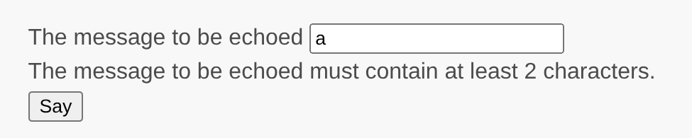

# Working with Forms

This section continues to improve on "Saying Hello". Instead of using URL, you will now ask user for a message via form.

Through this tutorial, you will learn how to:

* Create a form model to represent the data entered by a user through a form.
* Declare rules to validate the data entered.
* Build an HTML form in a view.

## Installing form package

To install form package, issue the following command in your application directory:

```
composer require yiisoft/form
```

## Creating a form <span id="creating-form"></span>

The data to be requested from the user will be represented by an `EchoForm` class as shown below and
saved in the file `/src/Form/EchoForm.php`:

```php
<?php
namespace App\Form;

use Yiisoft\FormModel\FormModel;

class EchoForm extends FormModel
{
    private string $message = '';

    public function getMessage(): string
    {
        return $this->message;
    }
}
```

To inherit from `FormModel` you need to install `form-model` by following commands:

```
composer require yiisoft/form-model
```

The `EchoForm` class has `$message` property and related getter.

## Using the form <span id="using-form"></span> 

Now, that you have a form, use it in your action from "[Saying Hello](hello.md)".

You also need to install hydrator package

```
composer require yiisoft/hydrator
```

Here's what you end up with in `/src/Controller/EchoController.php`:

```php
<?php

declare(strict_types=1);

namespace App\Controller;

use App\Form\EchoForm;
use Yiisoft\Yii\View\Renderer\ViewRenderer;
use Psr\Http\Message\ResponseInterface;
use Psr\Http\Message\ServerRequestInterface;
use Yiisoft\Hydrator\Hydrator;
use Yiisoft\Http\Method;

class EchoController
{
    private ViewRenderer $viewRenderer;

    public function __construct(ViewRenderer $viewRenderer)
    {
        $this->viewRenderer = $viewRenderer->withControllerName('echo');
    }

    public function say(ServerRequestInterface $request): ResponseInterface
    {
        $form = new EchoForm();
        $hydrator = new Hydrator();
    
        if ($request->getMethod() === Method::POST) {
            $hydrator->hydrate($form, $request->getParsedBody()['EchoForm']);
        }

        return $this->viewRenderer->render('say', [
            'form' => $form,
        ]);
    }
}
```

Instead of reading from request directly, you fill your form with the help of `Yiisoft\Hydrator\Hydrator::hydrate()` method if the request
method is POST and then pass it to your view.

Now, to allow POST, you need to adjust your route in `config/routes.php`:

```php
<?php

declare(strict_types=1);

use App\Controller\EchoController;
use App\Controller\SiteController;
use Yiisoft\Http\Method;
use Yiisoft\Router\Route;

return [
    Route::get('/')->action([SiteController::class, 'index'])->name('home'),
    Route::methods([Method::GET, Method::POST], '/say[/{message}]')->action([EchoController::class, 'say'])->name('echo/say'),
];
```

## Adjusting view

To render a form, you need to change your view, `resources/views/echo/say.php`:

```php
<?php

use Yiisoft\Form\Field\Text;
use Yiisoft\Html\Html;

/* @var \App\Form\EchoForm $form */
/* @var string $csrf */
/* @var \Yiisoft\Router\UrlGeneratorInterface $urlGenerator */
?>


<?php if (!empty($form->getMessage())): ?>
    <div class="notification is-success">
        The message is: <?= Html::encode($form->getMessage()) ?>
    </div>
<?php endif ?>

<?= Html::form()
    ->post($urlGenerator->generate('echo/say'))
    ->csrf($csrf)
    ->open() ?>

<?= Text::widget()
    ->name('EchoForm[message]')
    ->value($form->getMessage())
    ->label('Message')
    ->placeholder('Type your message')
    ->inputId('echoform-message'); ?>

<?= Html::submitButton('Say') ?>

<?= Html::form()->close() ?>
```

If a form has a message set, you're displaying a box with the message. The rest if about rendering the form.

You get the action URL from the URL manager service.
You access it as `$urlGenerator` that's a default parameter available in all views.
This variable and alike ones such as `$csrf` are provided by view injections listed in `config/common/params.php`:

```php
'yiisoft/yii-view-renderer' => [
    'injections' => [
        Reference::to(CommonViewInjection::class),
        Reference::to(CsrfViewInjection::class),
        Reference::to(LayoutViewInjection::class),
        Reference::to(TranslatorViewInjection::class),
    ],
],
```

You set the value of CSRF token, and it is rendered as a hidden input to ensure that the request originates from 
the form page and not from another website. It will be submitted along with POST form data. Omitting it would result in
[HTTP response code 422](https://tools.ietf.org/html/rfc4918#section-11.2).

CSRF protection is enabled by default. To turn off the CSRF protection,
you need to remove using `CsrfMiddleware` or `CsrfTokenMiddleware` to `config/common/di/router.php`:

```php
<?php

declare(strict_types=1);

use Yiisoft\Config\Config;
use Yiisoft\Csrf\CsrfMiddleware;
use Yiisoft\DataResponse\Middleware\FormatDataResponse;
use Yiisoft\Router\Group;
use Yiisoft\Router\RouteCollection;
use Yiisoft\Router\RouteCollectionInterface;
use Yiisoft\Router\RouteCollectorInterface;

/** @var Config $config */

return [
    RouteCollectionInterface::class => static function (RouteCollectorInterface $collector) use ($config) {
        $collector
            ->middleware(CsrfMiddleware::class) // <-- here
            ->middleware(FormatDataResponse::class)
            ->addGroup(
                Group::create()
                    ->routes(...$config->get('routes'))
            );

        return new RouteCollection($collector);
    },
];
    
    // ...
```

You use `Text::widget()` to output "message" field, so it takes case about filling the value, escaping it,
rendering field label and validation errors you're going to take care of next.

## Adding validation

Right now it's possible to submit an empty value. Make it required. Modify `/src/Controller/EchoController.php`:

```php
<?php

namespace App\Controller;

use App\Form\EchoForm;
use Psr\Http\Message\ResponseInterface;
use Psr\Http\Message\ServerRequestInterface;
use Yiisoft\Http\Method;
use Yiisoft\Validator\Validator;
use Yiisoft\Yii\View\Renderer\ViewRenderer;
use Yiisoft\Hydrator\Hydrator;

class EchoController
{
    private ViewRenderer $viewRenderer;

    public function __construct(ViewRenderer $viewRenderer)
    {
        $this->viewRenderer = $viewRenderer->withControllerName('echo');
    }

    public function say(ServerRequestInterface $request, Validator $validator): ResponseInterface
    {
        $form = new EchoForm();
        $hydrator = new Hydrator();
        $errors = null;

        if ($request->getMethod() === Method::POST) {
            $hydrator->hydrate($form, $request->getParsedBody()[$form->getFormName()]);
            $result = $validator->validate($form);
            if (!$result->isValid()) {
                $errors = $result->getErrors();
            }
        }

        return $this->viewRenderer->render('say', [
            'form' => $form,
            'errors' => $errors,
        ]);
    }
}
```

You've obtained validator instance through type-hinting and used it to validate the form.
Now you need to add validation rules to `/src/Form/EchoForm.php`:

```php
<?php
namespace App\Form;

use Yiisoft\Validator\Rule\Required;

class EchoForm
{
   #[Required]
    private string $message = '';

    public function getMessage(): string
    {
        return $this->message;
    }
}
```

Now, in case you will submit an empty message you will get a validation error: "Message cannot be blank."
Also, you can add required attribute to text field in `views/echo/say.php`.

```php
<?php

use Yiisoft\Form\Field\Text;
use Yiisoft\Html\Html;

/* @var \App\Form\EchoForm $form */
/* @var \Yiisoft\Validator\Error[]|null $errors */
/* @var string $csrf */
/* @var \Yiisoft\Router\UrlGeneratorInterface $urlGenerator */
?>


<?php if (!empty($form->getMessage())): ?>
    <div class="notification is-success">
        The message is: <?= Html::encode($form->getMessage()) ?>
    </div>
<?php endif ?>
<?php if (!empty($errors)): ?>
    <?php foreach($errors as $error): ?>
        <div class="notification is-errors">
            <?= Html::encode($error->getMessage()) ?>
        </div>
    <?php endforeach; ?>
<?php endif ?>

<?= Html::form()
    ->post($urlGenerator->generate('echo/say'))
    ->csrf($csrf)
    ->open() ?>

<?= Text::widget()
    ->name('EchoForm[message]')
    ->value($form->getMessage())
    ->label('Message')
    ->placeholder('Type your message')
    ->required(true) // <-- here
    ->inputId('echoform-message'); ?>

<?= Html::submitButton('Say') ?>

<?= Html::form()->close() ?>
```

## Trying it Out <span id="trying-it-out"></span>


To see how it works, use your browser to access the following URL:

```
http://localhost:8080/say
```

You will see a page displaying a form an input field that has a label that indicates what data are to be entered.
Also, there is a submit button labeled "Say". If you click the submit button without entering anything, you will see
an error message displayed next to a problematic input field.



After entering a message and clicking the submit button, you will see a new page
displaying the data that you just entered.


## Summary <span id="summary"></span>

In this section of the guide, you've learned how to create a form model class to represent the user data and validate
said data.

You've also learned how to get data from users and how to display data back in the browser.
This is a task that could take you a lot of time when developing an application, but Yii provides powerful widgets
to make this task easy.

In the next section, you will learn how to work with databases, which are needed in nearly every application.
