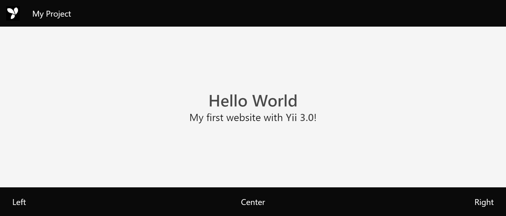

# Installing Yii

You can install Yii using the [Composer](https://getcomposer.org/) package manager.

We recommend starting with a project template that is a minimal working Yii project implementing some basic features.
Its code is organized in a recommended way. Therefore, it can serve as a good starting point for your projects.

## Installing Composer

If you do not already have Composer installed, you may do so by following the instructions at
[getcomposer.org](https://getcomposer.org/download/). On Linux and Mac OS X, you'll run the following commands:

```bash
curl -sS https://getcomposer.org/installer | php
sudo mv composer.phar /usr/local/bin/composer
```

On Windows, you'll download and run [Composer-Setup.exe](https://getcomposer.org/Composer-Setup.exe).

Please refer to the [Troubleshooting section of the Composer Documentation](https://getcomposer.org/doc/articles/troubleshooting.md)
if you encounter any problems.
If you are new to Composer, we also recommend reading at least the [Basic usage section](https://getcomposer.org/doc/01-basic-usage.md)
of the Composer documentation.

In this guide, all composer commands assume you have installed composer [globally](https://getcomposer.org/doc/00-intro.md#globally)
so that it is available as the `composer` command. If you are using the `composer.phar` in the local directory instead,
you have to adjust the example commands accordingly.

If you had Composer already installed before, make sure you use an up to date version. You can update Composer
by running `composer self-update`.

## Installing Yii <span id="installing-from-composer"></span>

With Composer installed, you can install Yii project template by running the following command
under a Web-accessible folder:

```bash
composer create-project yiisoft/app --prefer-dist --stability=dev your_project
```

This will install the latest <!-- stable -->version of Yii project template in a directory named `your_project`.
You can choose a different directory name if you want.

<!--
> Tip: If you want to install the latest development version of Yii, you may use the following command instead,
> which adds a [stability option](https://getcomposer.org/doc/04-schema.md#minimum-stability):
>
> ```bash
> composer create-project --prefer-dist --stability=dev yiisoft/yii-demo app
> ```
>
> Note that the development version of Yii should not be used for production as it may break your running code.
-->

## Using individual packages

Many Yii packages could be used separately from the framework via Composer. Framework-specific ones
have `yii-` prefix in their name.

## Verifying the Installation <span id="verifying-installation"></span>

After you finish installation, either configure your web server (see next section) or use the
[built-in PHP web server](https://secure.php.net/manual/en/features.commandline.webserver.php) by running the following
console command while in the project root directory:
 
```bash
../vendor/bin/yii serve
```

> Note: By default, the HTTP-server will listen to port 8080. However, if that port is already in use or you wish to 
serve multiple applications this way, you might want to specify what port to use. Just add the --port argument:

```bash
../vendor/bin/yii serve --port=8888
```

You can use your browser to access the installed Yii application with the following URL:

```
http://localhost:8080/
```



You should see the above page in your browser. If not, please check if your PHP installation satisfies
Yii's requirements by using [yiisoft/requirements package](https://github.com/yiisoft/requirements).


## Configuring Web Servers <span id="configuring-web-servers"></span>

> Info: You may skip this subsection for now if you are just test-driving Yii with no intention
  of deploying it to a production server.

The application installed according to the above instructions should work out of the box with either
an [Apache HTTP server](http://httpd.apache.org/) or an [Nginx HTTP server](http://nginx.org/), on
Windows, Mac OS X, or Linux running PHP 7.4 or higher.

On a production server, we recommend configuring your Web server so that the application can be accessed
via the URL `http://www.example.com/index.php` instead of `http://www.example.com/app/public/index.php`.
Such a configuration requires pointing the document root of your Web server to the `app/public` folder.
In this subsection, you'll learn how to configure your webserver achieve it.

> Info: By setting `app/public` as the document root, you also prevent end users from accessing
> your private application code and sensitive data files that are stored in the sibling directories
> of `app/public`. Denying access to those other folders is a security improvement.

> Info: If your application will run in a shared hosting environment where you do not have permission
> to modify its Web server configuration, you may still adjust the structure of your application for better security.
> Please refer to the [Shared Hosting Environment](tutorial-shared-hosting.md) section for more details.

> Info: If you are running your Yii application behind a reverse proxy, you might need to configure
> [Trusted proxies and headers](runtime-requests.md#trusted-proxies) in the request component.

### Apache <span id="apache"></span>

Use the following configuration in Apache's `httpd.conf` file or within a virtual host configuration. Note that you
should replace `path/to/app/public` with the actual path for `app/public`.

```apacheconfig
# Set document root to be "app/public"
DocumentRoot "path/to/app/public"

<Directory "path/to/app/public">
    # use mod_rewrite for pretty URL support
    RewriteEngine on
    
    # if $showScriptName is false in UrlManager, do not allow accessing URLs with script name
    RewriteRule ^index.php/ - [L,R=404]
    
    # If a directory or a file exists, use the request directly
    RewriteCond %{REQUEST_FILENAME} !-f
    RewriteCond %{REQUEST_FILENAME} !-d
    
    # Otherwise forward the request to index.php
    RewriteRule . index.php

    # ...other settings...
</Directory>
```

In case you have `AllowOverride All` you can add `.htaccess` file with the following configuration instead of
using `httpd.conf`:

```apacheconfig
# use mod_rewrite for pretty URL support
RewriteEngine on

# if $showScriptName is false in UrlManager, do not allow accessing URLs with script name
RewriteRule ^index.php/ - [L,R=404]

# If a directory or a file exists, use the request directly
RewriteCond %{REQUEST_FILENAME} !-f
RewriteCond %{REQUEST_FILENAME} !-d

# Otherwise forward the request to index.php
RewriteRule . index.php

# ...other settings...
```

### Nginx <span id="nginx"></span>

To use [Nginx](http://wiki.nginx.org/), you should install PHP as an [FPM SAPI](https://secure.php.net/install.fpm).
You may use the following Nginx configuration, replacing `path/to/app/public` with the actual path for 
`app/public` and `mysite.test` with the actual hostname to serve.

```nginx
server {
    charset utf-8;
    client_max_body_size 128M;

    listen 80; ## listen for ipv4
    #listen [::]:80 default_server ipv6only=on; ## listen for ipv6

    server_name mysite.test;
    root        /path/to/app/public;
    index       index.php;

    access_log  /path/to/basic/log/access.log;
    error_log   /path/to/basic/log/error.log;

    location / {
        # Redirect everything that isn't a real file to index.php
        try_files $uri $uri/ /index.php$is_args$args;
    }

    # uncomment to avoid processing of calls to non-existing static files by Yii
    #location ~ \.(js|css|png|jpg|gif|swf|ico|pdf|mov|fla|zip|rar)$ {
    #    try_files $uri =404;
    #}
    #error_page 404 /404.html;

    # deny accessing php files for the /assets directory
    location ~ ^/assets/.*\.php$ {
        deny all;
    }

    location ~ \.php$ {
        include fastcgi_params;
        fastcgi_param SCRIPT_FILENAME $document_root$fastcgi_script_name;
        fastcgi_pass 127.0.0.1:9000;
        #fastcgi_pass unix:/var/run/php5-fpm.sock;
        try_files $uri =404;
    }

    location ~* /\. {
        deny all;
    }
}
```

When using this configuration, you should also set `cgi.fix_pathinfo=0` in the `php.ini` file
to avoid many unnecessary system `stat()` calls.

Also, note that when running an HTTPS server, you need to add `fastcgi_param HTTPS on;` so that Yii
can properly detect if a connection is secure.

### NGINX Unit <span id="nginx-unit"></span>

You can run Yii-based apps using [NGINX Unit](https://unit.nginx.org/) with a PHP language module.
Here is a sample configuration.

```json
{
    "listeners": {
        "*:80": {
            "pass": "routes/yii"
        }
    },

    "routes": {
        "yii": [
            {
                "match": {
                    "uri": [
                        "!/assets/*",
                        "*.php",
                        "*.php/*"
                    ]
                },

                "action": {
                    "pass": "applications/yii/direct"
                }
            },
            {
                "action": {
                    "share": "/path/to/app/public/",
                    "fallback": {
                        "pass": "applications/yii/index"
                    }
                }
            }
        ]
    },

    "applications": {
        "yii": {
            "type": "php",
            "user": "www-data",
            "targets": {
                "direct": {
                    "root": "/path/to/app/public/"
                },

                "index": {
                    "root": "/path/to/app/public/",
                    "script": "index.php"
                }
            }
        }
    }
}
```

You can also [set up](https://unit.nginx.org/configuration/#php) your PHP environment or supply a custom `php.ini`
in the same configuration.

### IIS <span id="iss"></span>

When using [IIS](https://www.iis.net/), we recommend hosting the application in a virtual host (Web site) where document
root points to `path/to/app/web` folder and that Web site is configured to run PHP. In that `web` folder you have to
place a file named `web.config` i.e. `path/to/app/web/web.config`. Content of the file should be the following:

```xml
<?xml version="1.0" encoding="UTF-8"?>
<configuration>
<system.webServer>
<directoryBrowse enabled="false" />
  <rewrite>
    <rules>
      <rule name="Hide Yii Index" stopProcessing="true">
        <match url="." ignoreCase="false" />
        <conditions>
        <add input="{REQUEST_FILENAME}" matchType="IsFile" 
              ignoreCase="false" negate="true" />
        <add input="{REQUEST_FILENAME}" matchType="IsDirectory" 
              ignoreCase="false" negate="true" />
        </conditions>
        <action type="Rewrite" url="index.php" appendQueryString="true" />
      </rule> 
    </rules>
  </rewrite>
</system.webServer>
</configuration>
```

Also, the following list of Microsoft's official resources could be useful in order to configure PHP on IIS:

 1. [How to set up your first IIS Web site](https://support.microsoft.com/en-us/help/323972/how-to-set-up-your-first-iis-web-site)
 2. [Configure a PHP Website on IIS](https://docs.microsoft.com/en-us/iis/application-frameworks/scenario-build-a-php-website-on-iis/configure-a-php-website-on-iis)

### lighttpd <span id="lighttpd"></span>

To use [lighttpd](http://www.lighttpd.net/) >= 1.4.24 put `index.php` to webroot and add the following to configuration:

```
url.rewrite-if-not-file = ("(.*)" => "/index.php/$0")
```
