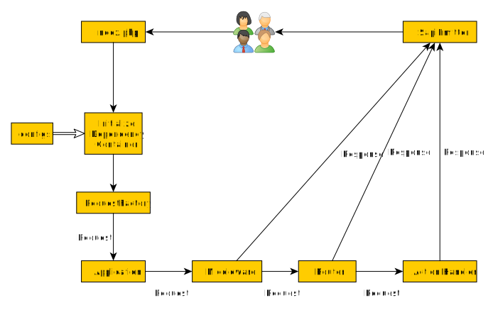

# Running Applications

After installing Yii, you have a working Yii application that can be launched via `./vendor/bin/yii serve` and then
accessed via the URL `http://localhost:8080/`. This section will introduce the application's built-in functionality,
how the code is organized, and how the application handles requests in general.

> Info: For simplicity, throughout this "Getting Started" tutorial, it's assumed that you have set `app/public`
  as the document root of your Web server, and configured the URL for accessing
  your application to be `http://localhost:8080/` or something similar.
  For your needs, please adjust the URLs in our descriptions accordingly.
  
Note that unlike the framework itself, after you install a project template, it is all yours. You're free to add or delete
code and overall modify it as you need.


## Functionality <span id="functionality"></span>

The application installed contains the following pages:

* the homepage, displayed when you access the URL `http://localhost:8080/`.

<!--
* the "About" page.
* the "Contact" page, which displays a contact form that allows end-users to contact you via email.
* and the "Login" page, which displays a login form that can be used to authenticate end-users. Try logging in
  with "admin/admin", and you will find the "Login" main menu item will change to "Logout"
-->

These pages share a common header and footer. The header contains the main menu bar to allow navigation
among different pages.

<!--
You should also see a toolbar at the bottom of the browser window.
This is a useful [debugger tool](https://github.com/yiisoft/yii-debug) provided by Yii to record and display a lot of
debugging information, such as log messages, response statuses, the database queries run, and so on.
-->

Additionally, to the web application, there is a console script accessible via `./vendor/bin/yii`.
This script can be used to run background and maintenance tasks for the application, which are described
in the [Console Application Section](../tutorial/console.md).


## Application Structure <span id="application-structure"></span>

The most important directories and files in your application are (assuming the application's root directory is `app`):

```
config/             Configuration files.
docs/               Documentation.
public/             Files publically accessible from the Internet.
    assets/         Published assets.
    index.php       Entry script.
resources/          Application resources.
    assets/         Asset bundle resources.
    layout/         Layout view templates.
    view/           View templates.
runtime/            Files generated during runtime.
src/                Application source code.
    Asset/          Asset bundle definitions.
    Controller/     Web controller classes.
    Provider/       Providers that take configuration and configure services.
tests/              A set of Codeception tests for the application.
vendor/             Installed Composer packages.
```

In general, the files in the application can be divided into two types: those under `app/public` and those
under other directories. The former can be directly accessed via HTTP (i.e., in a browser), while the latter cannot
and should not be.

Each application has an entry script `public/index.php` which is the only Web accessible PHP script in the application.
The entry script is creating an instance an incoming request with the help of one of PSR-7 packages
and passes it to [application](../structure/application.md) instance. An application contains a set of
middleware that are executed sequentially processing the request. The result is passed further to emitter
that takes care of sending a response to the browser.

Depending on the middleware used, the application may behave differently. By default, there is a router
that, based on URL requested and configuration, chooses a handler that is executed to produce a response.

You can learn more about the application template from
the [yiisoft/app package documentation](https://github.com/yiisoft/app/blob/master/README.md).

## Request Lifecycle <span id="request-lifecycle"></span>

The following diagram shows how an application handles a request.



1. A user makes a request to the [entry script](structure/entry-script.md) `public/index.php`.
2. The entry script loads the container configuration [configuration](concept/configuration.md) and creates
   an [application](structure/application.md) instance and services necessary to handle the request.
3. Request factory creates a request object based on raw request that came from a user.
4. Application passes request object through middleware array configured. One of these is typically a router.
5. Router finds out what handler to execute based on request and configuration.
6. The handler may load some data, possibly from a database.
7. The handler forms a response by using data. Either directly or with the help of the view package.
8. Emitter receives the response and takes care of sending the response to the user's browser.
