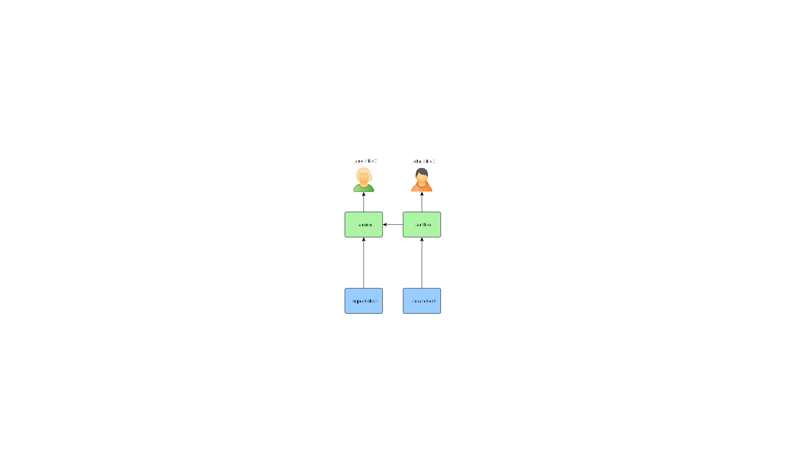
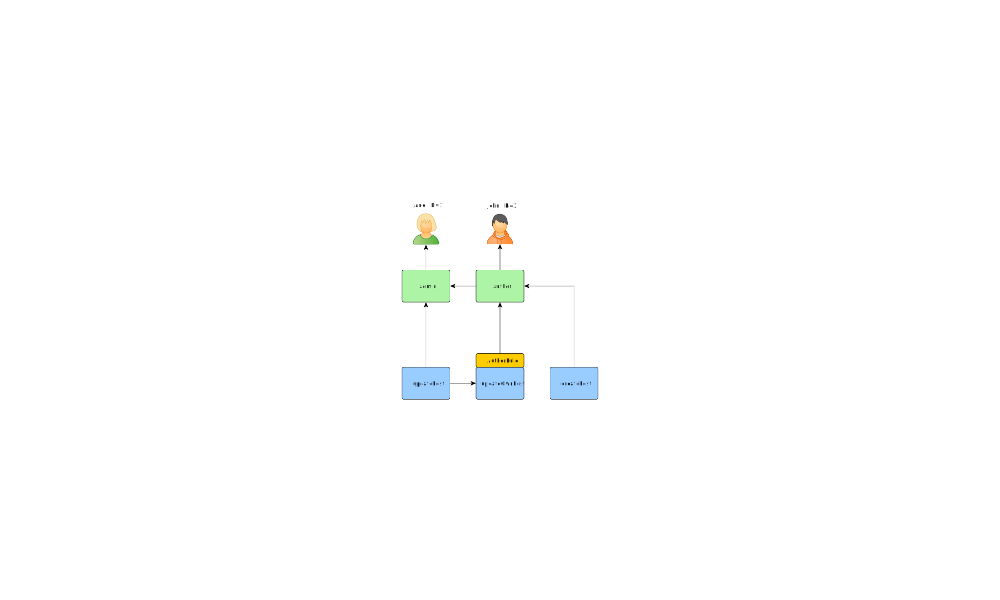
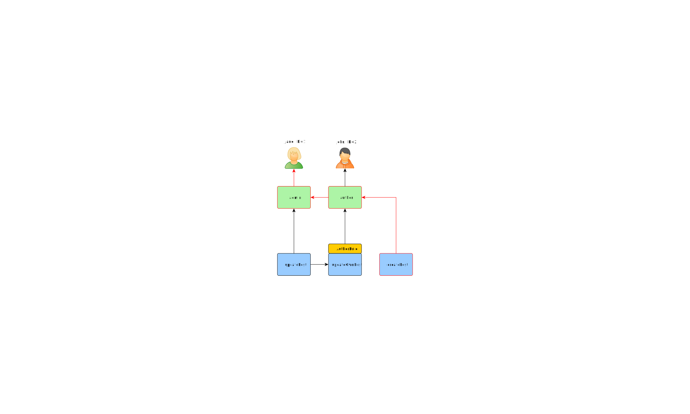
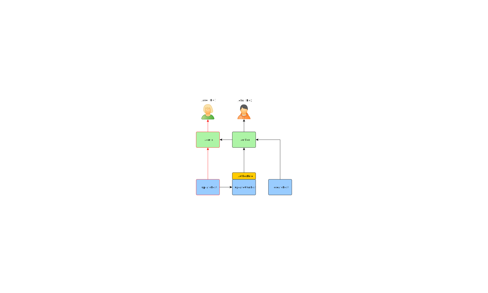

# Authorization

Authorization is the process of verifying that a user has enough permission to do something.

## Checking for permission

You can check if a user has certain permissions by using `\Yiisoft\Yii\Web\User\User` service:

```php
namespace App\Blog\Post;

use Psr\Http\Message\ServerRequestInterface;
use Yiisoft\Yii\Web\User\User;

class PostController
{
    public function actionEdit(ServerRequestInterface $request, User $user, PostRepository $postRepository)
    {
        $postId = $request->getAttribute('id');
        if ($postId === null) {
            // respond with 404        
        }
        
        $post = $postRepository->findByPK($postId);
        if ($post === null) {
            // respond with 404        
        }

        if (!$this->canEditPost($user, $post)) {
            // respond with 403        
        }
        
        // continue with editing a post
    }
    
    private function canEditPost(User $user, Post $post): bool
    {
        return $post->getAuthorId() === $user->getId() || $user->can('updatePost');    
    }
}
```

Behind the scenes, `Yiisoft\Yii\Web\User\User::can()` method calls `\Yiisoft\Access\AccessCheckerInterface::userHasPermission()`
so an implementation should be provided in dependency container in order for it to work. 

## Role Based Access Control (RBAC) <span id="rbac"></span>

Role-Based Access Control (RBAC) provides a simple yet powerful centralized access control. Please refer to
the [Wikipedia](http://en.wikipedia.org/wiki/Role-based_access_control) for details about comparing RBAC
with other more traditional access control schemes.

Yii implements a General Hierarchical RBAC, following the [NIST RBAC model](http://csrc.nist.gov/rbac/sandhu-ferraiolo-kuhn-00.pdf).

Using RBAC involves two parts of work. The first part is to build up the RBAC authorization data, and the second
part is to use the authorization data to perform access check in places where it is needed. Since RBAC implements
`\Yiisoft\Access\AccessCheckerInterface`, using it is similar to using any other implementation of access checker.

To facilitate our description next, we will first introduce some basic RBAC concepts.

### Basic Concepts <span id="basic-concepts"></span>

A role represents a collection of *permissions* (e.g. creating posts, updating posts). A role may be assigned
to one or multiple users. To check if a user has a specified permission, we may check if the user is assigned
with a role that contains that permission.

Associated with each role or permission, there may be a *rule*. A rule represents a piece of code that will be
executed during access check to determine if the corresponding role or permission applies to the current user.
For example, the "update post" permission may have a rule that checks if the current user is the post creator.
During access checking, if the user is NOT the post creator, he/she will be considered not having the "update post" permission.

Both roles and permissions can be organized in a hierarchy. In particular, a role may consist of other roles or permissions;
and a permission may consist of other permissions. Yii implements a *partial order* hierarchy which includes the
more special *tree* hierarchy. While a role can contain a permission, it is not `true` vice versa.


### Configuring RBAC <span id="configuring-rbac"></span>

RBAC is available via `yiisoft/rbac` package so we need to require it:

```
composer require yiisoft/rbac
```

Before we set off to define authorization data and perform access checking, we need to configure the
`\Yiisoft\Access\AccessCheckerInterface` in dependency container:

```php
use \Psr\Container\ContainerInterface;
use Yiisoft\Rbac\Manager\PhpManager;
use Yiisoft\Rbac\RuleFactory\ClassNameRuleFactory;

return [
    \Yiisoft\Access\AccessCheckerInterface::class => static function (ContainerInterface $container) {
        $aliases = $container->get(\Yiisoft\Aliases\Aliases::class);
        return new PhpManager(new ClassNameRuleFactory(), $aliases->get('@rbac'));
    }
];
```

`\Yiisoft\Rbac\Manager\PhpManager` uses a PHP script files to store authorization data. The files are located under
`@rbac` alias. Make sure the directory and all the files in it are writable by the Web server process if permissions
hierarchy needs to be changed online.

### Building Authorization Data <span id="generating-rbac-data"></span>

Building authorization data is all about the following tasks:

- defining roles and permissions;
- establishing relations among roles and permissions;
- defining rules;
- associating rules with roles and permissions;
- assigning roles to users.

Depending on authorization flexibility requirements the tasks above could be done in different ways.
If your permissions hierarchy is meant to be changed by developers only, you can use either migrations
or a console command. Migration pro is that it could be executed along with other migrations. Console
command pro is that you have a good overview of the hierarchy in the code rather than it being scattered
among multiple migrations.

Either way in the end you'll get the following RBAC hierarchy:



In case you need permissions hierarchy to be formed dynamically you need a UI or a console command. API used to
build the hierarchy itself won't be different.

### Using console command

If your permissions hierarchy doesn't change at all and you have a fixed number of users you can create a
-[console command](../tutorial/console-applications.md) that will initialize authorization data once via
APIs offered by `\Yiisoft\Rbac\ManagerInterface`:

```php
<?php
namespace App\Command;

use Symfony\Component\Console\Command\Command;
use Symfony\Component\Console\Input\InputInterface;
use Symfony\Component\Console\Output\OutputInterface;
use Yiisoft\Rbac\ManagerInterface;
use Yiisoft\Rbac\Permission;
use Yiisoft\Rbac\Role;
use Yiisoft\Yii\Console\ExitCode;

class RbacCommand extends Command
{
    private ManagerInterface $manager;
    protected static $defaultName = 'rbac/init';
    
    public function __construct(ManagerInterface $manager) {
        $this->manager = $manager;
    }
    
    public function configure(): void
    {
        $this
            ->setDescription('Builds RBAC hierarchy')
            ->setHelp('Launch to dump RBAC data');
    }

    protected function execute(InputInterface $input, OutputInterface $output): int
    {
        $auth = $this->manager;

        $auth->removeAll();                
        
        $createPost = (new Permission('createPost'))->withDescription('Create a post');        
        $auth->add($createPost);

        $updatePost = (new Permission('updatePost'))->withDescription('Update post');
        $auth->add($updatePost);

        // add "author" role and give this role the "createPost" permission
        $author = new Role('author');
        $auth->add($author);
        $auth->addChild($author, $createPost);

        // add "admin" role and give this role the "updatePost" permission
        // as well as the permissions of the "author" role
        $admin = new Role('admin');
        $auth->add($admin);
        $auth->addChild($admin, $updatePost);
        $auth->addChild($admin, $author);

        // Assign roles to users. 1 and 2 are IDs returned by IdentityInterface::getId()
        // usually implemented in your User model.
        $auth->assign($author, 2);
        $auth->assign($admin, 1);
        
        return ExitCode::OK;
    }
}
```
 
The command above could be executed from console the following way:

```
./vendor/bin/yii rbac/init
```

> If you don't want to hardcode what users have certain roles, don't put `->assign()` calls into the command. Instead,
  create either UI or console command to manage assignments.

#### Using migrations

**TODO**: finish it when migrations are implemented.

You can use [migrations](db-migrations.md)
to initialize and modify hierarchy via APIs offered by `\Yiisoft\Rbac\ManagerInterface`.

Create new migration using `./vendor/bin/yii migrate/create init_rbac` then impement creating a hierarchy:

```php
<?php
use yii\db\Migration;

use Yiisoft\Rbac\ManagerInterface;
use Yiisoft\Rbac\Permission;
use Yiisoft\Rbac\Role;

class m170124_084304_init_rbac extends Migration
{
    public function up()
    {
        $auth = /* obtain auth */;

        $auth->removeAll();                
                
        $createPost = (new Permission('createPost'))->withDescription('Create a post');        
        $auth->add($createPost);

        $updatePost = (new Permission('updatePost'))->withDescription('Update post');
        $auth->add($updatePost);

        // add "author" role and give this role the "createPost" permission
        $author = new Role('author');
        $auth->add($author);
        $auth->addChild($author, $createPost);

        // add "admin" role and give this role the "updatePost" permission
        // as well as the permissions of the "author" role
        $admin = new Role('admin');
        $auth->add($admin);
        $auth->addChild($admin, $updatePost);
        $auth->addChild($admin, $author);

        // Assign roles to users. 1 and 2 are IDs returned by IdentityInterface::getId()
        // usually implemented in your User model.
        $auth->assign($author, 2);
        $auth->assign($admin, 1);
    }
    
    public function down()
    {
        $auth = /* obtain auth */;

        $auth->removeAll();
    }
}
```

> If you don't want to hardcode which users have certain roles, don't put `->assign()` calls in migrations. Instead,
  create either UI or console command to manage assignments.

Migration could be applied by using `./vendor/bin/yii migrate`.

## Assigning roles to users

TODO: update when signup implemented in demo / template.

Author can create post, admin can update post and do everything author can.

If your application allows user signup you need to assign roles to these new users once. For example, in order for all
signed up users to become authors in your advanced project template you need to modify `frontend\models\SignupForm::signup()`
as follows:

```php
public function signup()
{
    if ($this->validate()) {
        $user = new User();
        $user->username = $this->username;
        $user->email = $this->email;
        $user->setPassword($this->password);
        $user->generateAuthKey();
        $user->save(false);

        // the following three lines were added:
        $auth = \Yii::$app->authManager;
        $authorRole = $auth->getRole('author');
        $auth->assign($authorRole, $user->getId());

        return $user;
    }

    return null;
}
```

For applications that require complex access control with dynamically updated authorization data, special user interfaces
(i.e. admin panel) may need to be developed using APIs offered by `authManager`.


### Using Rules <span id="using-rules"></span>

As aforementioned, rules add additional constraint to roles and permissions. A rule is a class extending
from `\Yiisoft\Rbac\Rule`. It must implement the `execute()` method. In the hierarchy we've
created previously author cannot edit his own post. Let's fix it. First we need a rule to verify that the user is the post author:

```php
namespace App\User\Rbac;

use Yiisoft\Rbac\Item;
use \Yiisoft\Rbac\Rule;

/**
 * Checks if authorID matches user passed via params
 */
class AuthorRule extends Rule
{
    private const NAME = 'isAuthor';

    public function __construct() {
        parent::__construct(self::NAME);
    }

    public function execute(string $userId, Item $item, array $parameters = []): bool
    {
        return isset($params['post']) ? $params['post']->getAuthorId() == $userId : false;
    }
}
```

The rule above checks if the `post` is created by user rule is checked for. We'll create a special permission `updateOwnPost` in the
command we've used previously:

```php
/** @var \Yiisoft\Rbac\ManagerInterface $auth */

// add the rule
$rule = new AuthorRule();
$auth->add($rule);

// add the "updateOwnPost" permission and associate the rule with it.
$updateOwnPost = (new \Yiisoft\Rbac\Permission('updateOwnPost'))
    ->withDescription('Update own post')
    ->withRuleName($rule->getName());
$auth->add($updateOwnPost);

// "updateOwnPost" will be used from "updatePost"
$auth->addChild($updateOwnPost, $updatePost);

// allow "author" to update their own posts
$auth->addChild($author, $updateOwnPost);
```

Now we have got the following hierarchy:




### Access Check <span id="access-check"></span>

The check is done similar to how it was done in the first section of this guide:

```php
namespace App\Blog\Post;

use Psr\Http\Message\ServerRequestInterface;
use Yiisoft\Yii\Web\User\User;

class PostController
{
    public function actionEdit(ServerRequestInterface $request, User $user, PostRepository $postRepository)
    {
        $postId = $request->getAttribute('id');
        if ($postId === null) {
            // respond with 404        
        }
        
        $post = $postRepository->findByPK($postId);
        if ($post === null) {
            // respond with 404        
        }

        if (!$this->canEditPost($user, $post)) {
            // respond with 403        
        }
        
        // continue with editing a post
    }
    
    private function canEditPost(User $user, Post $post): bool
    {
        return $user->can('updatePost', ['post' => $post]);    
    }
}
```

The difference is that now checking for user's own post is part of the RBAC.

If the current user is Jane with `ID=1` we are starting at `createPost` and trying to get to `Jane`:



In order to check if a user can update a post, we need to pass an extra parameter that is required by `AuthorRule` described before:

```php
if ($user->can('updatePost', ['post' => $post])) {
    // update post
}
```

Here is what happens if the current user is John:


We are starting with the `updatePost` and going through `updateOwnPost`. In order to pass the access check, `AuthorRule`
should return `true` from its `execute()` method. The method receives its `$params` from the `can()` method call, so the value is
`['post' => $post]`. If everything is fine, we will get to `author` which is assigned to John.

In case of Jane it is a bit simpler since she is an admin:



## Implementing your own access checker

In case RBAC does not suit your needs, you can implement your own access checker without changing application code:


```php
namespace App\User;

use \Yiisoft\Access\AccessCheckerInterface;

class AccessChecker implements AccessCheckerInterface
{
    private const PERMISSIONS = [
        [
            1 => ['editPost'],
            42 => ['editPost', 'deletePost'],
        ],
    ];

    public function userHasPermission($userId, string $permissionName, array $parameters = []) : bool
    {
        if (!array_key_exists($userId, self::PERMISSIONS)) {
            return false;
        }

        return in_array($permissionName, self::PERMISSIONS[$userId], true); 
    }
}
```
