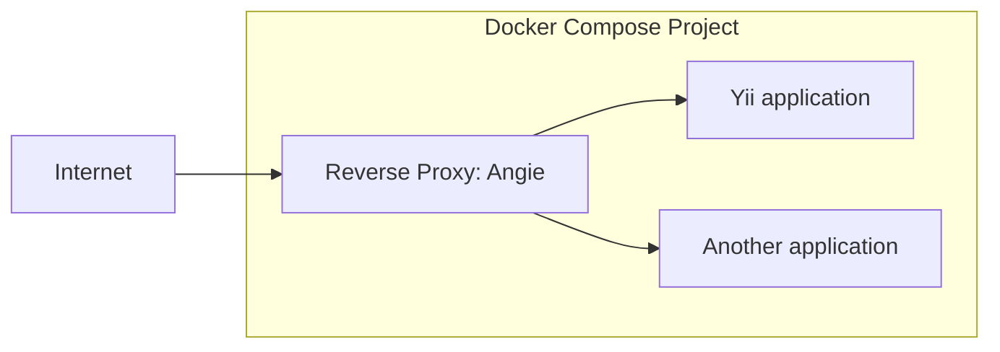

# Deploying Yii applications with Angie Docker Proxy

[Angie Docker Proxy](https://hub.docker.com/r/angiesoftware/proxy) is a small reverse proxy for Docker Compose projects. It runs in a separate container alongside the
applications, reads the Docker API through the Docker socket, discovers containers using the `VIRTUAL_HOST` and
`VIRTUAL_PORT` environment variables, generates the Angie configuration, and automatically obtains TLS certificates
using ACME.

This approach is useful when you need to run several web applications on one server and enable HTTPS for them without
manually editing the reverse proxy configuration for each domain.

In this example, we'll connect a containerized Yii application to Angie Docker Proxy and configure automatic HTTPS.

This guide assumes that your Yii application is already packaged as a Docker image and accepts HTTP requests on port 80. Building and configuring the application image is outside the scope of this guide.



## Prerequisites

- A server with a fresh Linux distribution.
- A domain name pointing to your server's IP address.
- Docker and Docker Compose.
- Open TCP ports `80` and `443`.
- SSH access to your server.
- Basic knowledge of Docker and command-line tools.

## Project structure

The example requires a single Docker Compose configuration:

```text
yii-angie-demo/
└── docker-compose.yml
```

## Configuring Docker Compose

Create `docker-compose.yml` with the following configuration. Replace:

- `admin@example.com` with your email address;
- `registry.example.com/yii-app:1.0.0` with your application image;
- `example-demo.example.com` with the domain pointing to your server.

```yaml
services:
  angie-proxy:
    image: angiesoftware/proxy:latest
    environment:
      - ANGIE_ACME_EMAIL=admin@example.com
      - ANGIE_ACME_URL=https://acme-v02.api.letsencrypt.org/directory
      - ANGIE_RESOLVER=1.1.1.1 8.8.8.8
      - ANGIE_RESOLVER_VALID=300s
      - ANGIE_PROXY_NETWORK=proxy
    ports:
      - "80:80"
      - "443:443"
    volumes:
      - /var/run/docker.sock:/tmp/docker.sock:ro
      - angie_acme:/var/lib/angie/acme
    networks:
      - proxy

  yii-app:
    image: registry.example.com/yii-app:1.0.0
    environment:
      - VIRTUAL_HOST=example-demo.example.com
      - VIRTUAL_PORT=80
    networks:
      - proxy

networks:
  proxy:
    name: proxy

volumes:
  angie_acme:
```

`VIRTUAL_HOST` is the application's public domain.

`VIRTUAL_PORT` is the container's internal port to which Angie should proxy requests.

Angie Docker Proxy automatically discovers `VIRTUAL_HOST` and `VIRTUAL_PORT` from the environment variables and issues
certificates using the Angie ACME module and Let's Encrypt.

## Starting the services

Start the proxy and application containers:

```bash
docker compose up -d
```

## Adding another application

To expose another application, add it to `services` in `docker-compose.yml` and attach it to the `proxy` network:

```yaml
services:
  second-app:
    image: traefik/whoami
    environment:
      - VIRTUAL_HOST=example-demo2.example.com
      - VIRTUAL_PORT=80
    networks:
      - proxy
```

Apply the changes:

```bash
docker compose up -d
```

## How it works

Angie Docker Proxy monitors the Docker API and discovers containers configured with `VIRTUAL_HOST` and `VIRTUAL_PORT`.
It generates the Angie configuration, obtains TLS certificates using ACME, and forwards incoming requests to the
corresponding containers through the shared Docker network.

When containers are added, removed, or updated, the proxy regenerates its configuration and performs a graceful reload.
Existing connections continue to be handled while the updated configuration is applied.

For configuration options and implementation details, see the
[Angie Docker Proxy documentation](https://hub.docker.com/r/angiesoftware/proxy).

## Verification

Check the containers:

```bash
docker compose ps
```

Check the HTTP redirect:

```bash
curl -I http://example-demo.example.com/
```

Expected result:

```text
HTTP/1.1 301 Moved Permanently
Location: https://example-demo.example.com/
```

Check HTTPS:

```bash
curl -I https://example-demo.example.com/
```

Expected result:

```text
HTTP/1.1 200 OK
Server: Angie/...
```

Check the certificate:

```bash
echo | openssl s_client \
  -connect example-demo.example.com:443 \
  -servername example-demo.example.com 2>/dev/null \
  | openssl x509 -noout -issuer -subject -dates
```

Expected issuer:

```text
Let's Encrypt
```


## Logs

Proxy logs:

```bash
docker compose logs -f angie-proxy
```

## Stopping the services

Stop the services:

```bash
docker compose down
```

Stop the services and remove the certificates:

```bash
docker compose down -v
```

## Limitations

This setup is intended for Docker Compose. Kubernetes doesn't expose workloads through the Docker API and requires an
Ingress or Gateway API controller. Docker Swarm also uses the Docker API, but Swarm deployment isn't covered in this
guide.

## For more information

- [Angie Docker Proxy documentation](https://hub.docker.com/r/angiesoftware/proxy)
- [Yii Application Template](https://github.com/yiisoft/app)
- [Docker in Yii Application Templates](https://yiisoft.github.io/docs/guide/tutorial/docker.html)
- [Docker Compose documentation](https://docs.docker.com/compose/)
