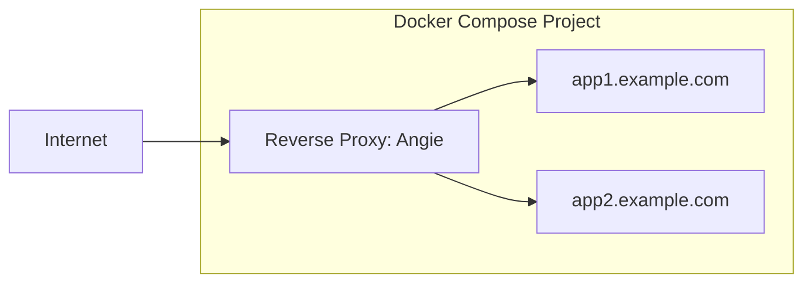

# Deploying Yii applications with Angie Docker Proxy

[Angie Docker Proxy ](https://hub.docker.com/r/angiesoftware/proxy)is a small reverse proxy for Docker Compose projects. It runs in a separate container alongside the
applications, reads the Docker API through the Docker socket, discovers containers using the `VIRTUAL_HOST` and
`VIRTUAL_PORT` environment variables, generates the Angie configuration, and automatically obtains TLS certificates
using ACME.

This approach is useful when you need to run several web applications on one server and enable HTTPS for them without
manually editing the reverse proxy configuration for each domain.

In this example, we'll deploy a minimal Yii application with Angie Docker Proxy. The example is small and clearly
demonstrates how the proxy, ACME, and the addition of new services work.



## Prerequisites

- A server with a fresh Linux distribution.
- A domain name pointing to your server's IP address.
- Docker and Docker Compose.
- Open TCP ports `80` and `443`.
- SSH access to your server.
- Basic knowledge of Docker and command-line tools.

## `yii-app` project structure

The prepared `yii-app` project uses the following project structure:

```text
yii-angie-demo/
├── docker-compose.yml
└── proxy
|    ├── Dockerfile
|    ├── entrypoint.sh
|    └── templates
|       └──  angie.tmpl
└── yii-app
    ├── ...
    ├── ...
    └── 
```

Create `yii-app` from the official Yii application template:

```bash
composer create-project yiisoft/app yii-app
```


This article focuses on Angie Docker Proxy, so the internal Yii application configuration is not covered here. The
application container uses its production Docker target and exposes HTTP on port `80`.

#### Detailed description of Angie Docker Proxy

`Dockerfile`:

```dockerfile
FROM ubuntu:24.04

ARG DOCKER_GEN_VERSION=0.16.0

RUN apt-get update \
  && apt-get install -y --no-install-recommends ca-certificates curl tar gnupg \
  && install -d -m 0755 /etc/apt/keyrings \
  && curl --retry 8 --retry-all-errors --retry-delay 3 --connect-timeout 20 -fsSL https://angie.software/keys/angie-signing.gpg -o /etc/apt/keyrings/angie.gpg \
  && chmod 0644 /etc/apt/keyrings/angie.gpg \
  && . /etc/os-release \
  && echo "deb [signed-by=/etc/apt/keyrings/angie.gpg] https://download.angie.software/angie/ubuntu/24.04 ${VERSION_CODENAME} main" > /etc/apt/sources.list.d/angie.list \
  && apt-get update \
  && apt-get install -y --no-install-recommends angie \
  && curl --retry 8 --retry-all-errors --retry-delay 3 --connect-timeout 20 -fsSL "https://github.com/nginx-proxy/docker-gen/releases/download/${DOCKER_GEN_VERSION}/docker-gen-linux-amd64-${DOCKER_GEN_VERSION}.tar.gz" \
    | tar -xz -C /usr/local/bin docker-gen \
  && chmod +x /usr/local/bin/docker-gen \
  && rm -rf /var/lib/apt/lists/*

COPY templates/angie.tmpl /etc/docker-gen/templates/angie.tmpl
COPY entrypoint.sh /entrypoint.sh

RUN chmod +x /entrypoint.sh

EXPOSE 80 443

ENTRYPOINT ["/entrypoint.sh"]
```

- Installing Angie OSS.
- Installing `docker-gen`.
- Copying the `entrypoint.sh` script and `angie.tmpl` template.
- Exposing ports `80` and `443` for proxying.
- Starting the `entrypoint.sh` script.

`entrypoint.sh`:

```sh
#!/bin/sh
set -e

export DOCKER_HOST=unix:///tmp/docker.sock

mkdir -p /etc/angie /etc/angie/conf.d
mkdir -p /var/lib/angie/acme

docker-gen -watch=false /etc/docker-gen/templates/angie.tmpl /etc/angie/angie.conf

angie -t -c /etc/angie/angie.conf
angie -c /etc/angie/angie.conf

exec docker-gen -watch -notify "angie -s reload" /etc/docker-gen/templates/angie.tmpl /etc/angie/angie.conf
```

Inside the container, `entrypoint.sh` specifies where the Docker API is located:

```sh
export DOCKER_HOST=unix:///tmp/docker.sock
```

Creating directories for `angie.conf` and ACME.

Starting `docker-gen` in `-watch` mode.

`templates/angie.tmpl`:

```text
events {}

http {
{{ $acmeURL := or (index .Env "ANGIE_ACME_URL") "https://acme-v02.api.letsencrypt.org/directory" }}
{{ $acmeEmail := or (index .Env "ANGIE_ACME_EMAIL") "admin@example.com" }}
{{ $resolver := or (index .Env "ANGIE_RESOLVER") "1.1.1.1 8.8.8.8" }}
{{ $resolverValid := or (index .Env "ANGIE_RESOLVER_VALID") "300s" }}
{{ $proxyNetwork := or (index .Env "ANGIE_PROXY_NETWORK") "proxy" }}

    resolver {{ $resolver }} valid={{ $resolverValid }};

{{ range $host, $containers := groupByMulti . "Env.VIRTUAL_HOST" "," }}
{{ $slug := replace (replace (toLower $host) "." "_" -1) "-" "_" -1 }}
    acme_client {{ $slug }} {{ $acmeURL }}
        email={{ $acmeEmail }}
        challenge=http;
{{ end }}

    access_log /dev/stdout;
    error_log /dev/stderr notice;

    server {
        listen 80 default_server;
        server_name _;
        return 404;
    }

{{ range $host, $containers := groupByMulti . "Env.VIRTUAL_HOST" "," }}
{{ $container := index $containers 0 }}
{{ $port := or (index $container.Env "VIRTUAL_PORT") "80" }}
{{ $slug := replace (replace (toLower $host) "." "_" -1) "-" "_" -1 }}
{{ range $network := $container.Networks }}
{{ if eq $network.Name $proxyNetwork }}
    server {
        listen 80;
        server_name {{ $host }};

        location / {
            return 301 https://$host$request_uri;
        }
    }

    server {
        listen 443 ssl;
        server_name {{ $host }};

        acme {{ $slug }};

        ssl_certificate $acme_cert_{{ $slug }};
        ssl_certificate_key $acme_cert_key_{{ $slug }};

        location / {
            proxy_pass http://{{ $network.IP }}:{{ $port }};
            proxy_http_version 1.1;
            proxy_set_header Host $host;
            proxy_set_header X-Real-IP $remote_addr;
            proxy_set_header X-Forwarded-For $proxy_add_x_forwarded_for;
            proxy_set_header X-Forwarded-Proto $scheme;
            proxy_set_header X-Forwarded-Host $host;
        }
    }
{{ end }}
{{ end }}
{{ end }}
}
```

`templates/angie.tmpl` is a Go template for `docker-gen`. It is used to generate the final Angie configuration at
`/etc/angie/angie.conf`.

The template reads container metadata from Docker and selects services that have `VIRTUAL_HOST` and `VIRTUAL_PORT`
configured.

For every domain it finds, the template:

- Generates a separate `acme_client`.
- Converts the domain into a slug for the ACME client name, for example,
  `example-demo.example.com -> example_demo_example_com`.
- Creates an HTTPS `server` block on port `443`.
- Configures the Angie ACME certificate using `$acme_cert_<slug>` and `$acme_cert_key_<slug>`.
- Selects the container IP only from the shared `proxy` network.
- Generates `proxy_pass` for the container's internal port specified by `VIRTUAL_PORT`.

The template also uses the following settings from the proxy container:

- `ANGIE_ACME_EMAIL`.
- `ANGIE_ACME_URL`.
- `ANGIE_RESOLVER`.
- `ANGIE_RESOLVER_VALID`.
- `ANGIE_PROXY_NETWORK`.

When a new container with `VIRTUAL_HOST` and `VIRTUAL_PORT` appears, `docker-gen` regenerates `angie.conf`, after which
Angie reloads the configuration with `angie -s reload`.

## `docker-compose.yml` structure

The following `docker-compose.yml` configuration uses Angie Docker Proxy:

```yaml
services:
  angie-proxy:
    image: angiesoftware/proxy:latest
    environment:
      - ANGIE_ACME_EMAIL=admin@example.com
      - ANGIE_ACME_URL=https://acme-v02.api.letsencrypt.org/directory
      - ANGIE_RESOLVER=1.1.1.1 8.8.8.8
      - ANGIE_RESOLVER_VALID=300s
      - ANGIE_PROXY_NETWORK=proxy
    ports:
      - "80:80"
      - "443:443"
    volumes:
      - /var/run/docker.sock:/tmp/docker.sock:ro
      - angie_acme:/var/lib/angie/acme
    networks:
      - proxy

  yii-app:
    build:
      context: ./yii-app
    environment:
      - VIRTUAL_HOST=angie-demo.example.ru
      - VIRTUAL_PORT=80
      - APP_NAME=Yii demo behind Angie HTTPS
    networks:
      - proxy

networks:
  proxy:
    name: proxy

volumes:
  angie_acme:
```

## Starting the application

To start the application, run the Docker Compose build:

```bash
docker compose up -d --build
```

For Angie Docker Proxy to discover a service, the application must be attached to the same `proxy` network and have
two environment variables:

```yaml
environment:
    - VIRTUAL_HOST=example-demo.example.com
    - VIRTUAL_PORT=80
```

`VIRTUAL_HOST` is the application's public domain.

`VIRTUAL_PORT` is the container's internal port to which Angie should proxy requests.

Angie Docker Proxy automatically discovers `VIRTUAL_HOST` and `VIRTUAL_PORT` from the environment variables and issues
certificates using the Angie ACME module and Let's Encrypt.

Adding a new application or service to `docker-compose.yml`:

```yaml
second_app:
  image: traefik/whoami
  environment:
    - VIRTUAL_HOST=example-demo2.example.com
    - VIRTUAL_PORT=80
networks:
  - proxy
```

After adding the new service block, apply the changes:

```bash
docker compose up -d
```

## How it works

Angie Docker Proxy runs in a separate container alongside the applications. The container includes Angie, `docker-gen`,
the `angie.tmpl` configuration template, and the entrypoint script. When `docker compose up -d` runs, the `angie-proxy`
container starts and the Docker socket is mounted into it in read-only mode.

The Angie Docker Proxy image contains:

- Angie OSS.
- `docker-gen`.
- The `angie.tmpl` template.
- `entrypoint.sh`, which starts configuration generation and Angie itself.

Workflow:

After `docker compose up -d --build` runs, the following sequence takes place:

```text
Docker API
-> docker-gen
-> /etc/angie/angie.conf
-> angie -t
-> Angie startup
-> ACME certificate issuance
-> reverse proxy to yii-app
```

`docker-gen` monitors the Docker socket:

```yaml
volumes:
  - /var/run/docker.sock:/tmp/docker.sock:ro
```

Inside the container, `entrypoint.sh` specifies where the Docker API is located:

```sh
export DOCKER_HOST=unix:///tmp/docker.sock
```

After startup, `docker-gen` remains in watch mode. When a new container with `VIRTUAL_HOST` appears, it regenerates
`/etc/angie/angie.conf` and runs:

```sh
angie -s reload
```

For each domain, the template generates a separate `acme_client`. The client name is built from the domain by replacing
dots and hyphens with underscores.

Example:

`example-demo.example.com -> example_demo_example_com`

Certificates are stored separately for each server.

When generating an upstream, the container IP is selected only from the shared `proxy` network. This is important
because a container can be connected to multiple Docker networks, but the reverse proxy needs an address from the
network shared with `angie-proxy`.

## Verification

Check the containers:

```bash
docker compose ps
```

Check the HTTP redirect:

```bash
curl -I http://example-demo.example.com/
```

Expected result:

```text
HTTP/1.1 301 Moved Permanently
Location: https://example-demo.example.com/
```

Check HTTPS:

```bash
curl -I https://example-demo.example.com/
```

Expected result:

```text
HTTP/1.1 200 OK
Server: Angie/...
```

Check the certificate:

```bash
echo | openssl s_client \
  -connect example-demo.example.com:443 \
  -servername example-demo.example.com 2>/dev/null \
  | openssl x509 -noout -issuer -subject -dates
```

Expected issuer:

```text
Let's Encrypt
```

## Logs

Proxy logs:

```bash
docker compose logs -f angie-proxy
```

## Stopping the services

Stop the services:

```bash
docker compose down
```

Stop the services and remove the certificates:

```bash
docker compose down -v
```

## For more information

- [Yii Application Template](https://github.com/yiisoft/app)
- [Docker Compose documentation](
