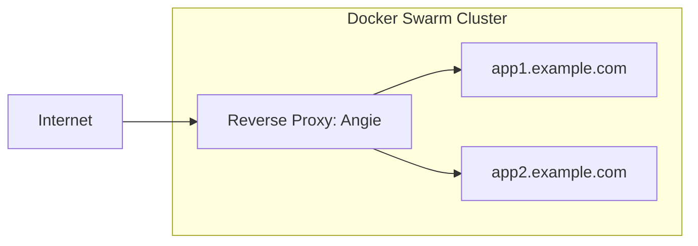

# Deploying Yii applications to Docker Swarm and Angie

This guide walks you through deploying a Yii application to [Docker Swarm](https://docs.docker.com/engine/swarm/)
starting from a blank server, using [Angie](https://angie.software/) as
a reverse proxy and deploying from a container registry ([Forgejo](https://forgejo.org/) or [Gitea](https://about.gitea.com/)).

Angie is a high-performance web server and reverse proxy that is a drop-in replacement for nginx with enhanced features,
including native support for ACME protocol for automated SSL certificates and Docker label-based configuration.



## Prerequisites

- A server with a fresh installation of a Linux distribution (Ubuntu 22.04 LTS or later recommended)
- A domain name pointing to your server's IP address
- SSH access to your server
- Basic knowledge of Docker and command-line tools

## Server preparation

### Install Docker

For installation instructions, see the [official Docker documentation](https://docs.docker.com/engine/install/ubuntu/).

### Initialize Docker Swarm

Initialize your server as a Docker Swarm manager:

```bash
docker swarm init --advertise-addr <YOUR_SERVER_IP>
```

Replace `<YOUR_SERVER_IP>` with your server's public IP address.

### Set up the reverse proxy network

Create a dedicated overlay network for reverse proxy to communicate with your services:

```bash
docker network create --driver=overlay reverse_proxy_public
```

## Setting up Angie as reverse proxy

Angie provides automatic service discovery through Docker labels and built-in ACME support for SSL certificates.

Create a file `angie-stack.yml`:

```yaml
services:
  angie:
    image: docker.angie.software/angie:latest
    ports:
      - "80:80"
      - "443:443"
    volumes:
      - /var/run/docker.sock:/var/run/docker.sock:ro
      - angie_certs:/etc/angie/acme
    configs:
      - source: angie_main_config
        target: /etc/angie/angie.conf
    networks:
      - reverse_proxy_public
    deploy:
      placement:
        constraints:
          - node.role == manager

configs:
  angie_main_config:
    content: |
      load_module modules/ngx_http_docker_module.so;
      load_module modules/ngx_http_acme_module.so;

      user nginx;
      worker_processes auto;
      error_log /var/log/angie/error.log notice;
      pid /var/run/angie.pid;

      events {
          worker_connections 1024;
      }

      http {
          include /etc/angie/mime.types;
          default_type application/octet-stream;

          log_format main '$remote_addr - $remote_user [$time_local] "$request" '
                          '$status $body_bytes_sent "$http_referer" '
                          '"$http_user_agent" "$http_x_forwarded_for"';

          access_log /var/log/angie/access.log main;

          sendfile on;
          tcp_nopush on;
          keepalive_timeout 65;
          gzip on;

          # DNS resolver for ACME
          resolver 8.8.8.8 8.8.4.4 valid=300s;
          resolver_timeout 5s;

          # ACME client configuration
          acme_client letsencrypt https://acme-v02.api.letsencrypt.org/directory
                      email=admin@example.com;

          # Docker service discovery
          docker_endpoint unix:/var/run/docker.sock;

          # Default server for HTTP (ACME challenges and redirect to HTTPS)
          server {
              listen 80 default_server;
              listen [::]:80 default_server;
              server_name _;

              # Redirect all HTTP traffic to HTTPS except ACME challenges
              location / {
                  return 301 https://$host$request_uri;
              }
          }
      }

volumes:
  angie_certs:

networks:
  reverse_proxy_public:
    external: true
```

Deploy Angie:

```bash
docker stack deploy -c angie-stack.yml angie
```

Angie automatically discovers services with Angie labels and sets up HTTPS using the ACME protocol with Let's Encrypt.

> [!IMPORTANT]
> Make sure your domain DNS records are configured and pointing to your server before deploying services with
> Angie labels, as Let's Encrypt requires domain validation.

## Setting up a container registry

You need a container registry to store your Docker images. Choose one of the following options.

### Option 1: Using Forgejo

To deploy Forgejo create a file `forgejo-stack.yml`:

```yaml
services:
  forgejo:
    image: codeberg.org/forgejo/forgejo:1.21
    volumes:
      - forgejo_data:/data
    networks:
      - reverse_proxy_public
    deploy:
      labels:
        - "angie.http.upstreams.forgejo.port=3000"

volumes:
  forgejo_data:

networks:
  reverse_proxy_public:
    external: true
```

Deploy Forgejo:

```bash
docker stack deploy -c forgejo-stack.yml forgejo
```

Replace `git.example.com` with your desired subdomain.

After deployment, access Forgejo at `https://git.example.com` and complete the initial setup. Make sure to enable the container registry in the settings.

### Option 2: Using Gitea

To deploy Gitea create a file `gitea-stack.yml`:

```yaml
services:
  gitea:
    image: gitea/gitea:latest
    volumes:
      - gitea_data:/data
    networks:
      - reverse_proxy_public
    deploy:
      labels:
        - "angie.http.upstreams.gitea.port=3000"

volumes:
  gitea_data:

networks:
  reverse_proxy_public:
    external: true
```

Deploy Gitea:

```bash
docker stack deploy -c gitea-stack.yml gitea
```

Replace `git.example.com` with your desired subdomain.

After deployment, access Gitea at `https://git.example.com` and complete the initial setup. 
Make sure to enable the container registry in the settings.

## Configuring your Yii application

### Update the Makefile configuration

The [Yii application template](https://github.com/yiisoft/app) includes a Makefile with deployment commands. Update the `docker/.env` file in your project:

```bash
STACK_NAME=myapp

#
# Production
#

PROD_HOST=app.example.com
PROD_SSH="ssh://user@your-server-ip"

IMAGE=git.example.com/username/myapp
IMAGE_TAG=latest
```

Replace the values:
- `STACK_NAME`: A unique name for your application stack
- `PROD_HOST`: The domain name where your app will be accessible
- `PROD_SSH`: SSH connection string to your server (format: `ssh://user@host`)
- `IMAGE`: Full path to your container image in the registry
- `IMAGE_TAG`: Image tag, typically `latest` or a version number

### Configure the production environment

Update `docker/prod/.env` with your production environment variables:

```bash
APP_ENV=prod
YII_DEBUG=false
YII_ENV=prod

# Database configuration
DB_HOST=db
DB_NAME=myapp
DB_USER=myapp
DB_PASSWORD=secure_password_here

# Add other environment-specific variables
```

> [!WARNING]
> Never commit sensitive credentials to version control. Use `docker/prod/override.env` for sensitive values and add it to `.gitignore`.

### Review the production Docker Compose configuration

When using Angie, you'll need to modify the Yii application's `docker/prod/compose.yml` to use Angie labels
instead of Caddy labels:

```yaml
services:
  app:
    image: ${IMAGE}:${IMAGE_TAG}
    networks:
      - reverse_proxy_public
    volumes:
      - runtime:/app/runtime
      - caddy_data:/data
      - caddy_config:/config
    env_file:
      - path: ./prod/.env
      - path: ./prod/override.env
        required: false
    environment:
      CADDY_EXTRA_CONFIG: 'auto_https off'
    deploy:
      replicas: 2
      update_config:
        delay: 10s
        parallelism: 1
        order: start-first
        failure_action: rollback
        monitor: 10s
      rollback_config:
        parallelism: 0
        order: stop-first
      restart_policy:
        condition: on-failure
        delay: 5s
        max_attempts: 3
        window: 120s
      labels:
        - "angie.http.upstreams.myapp.port=80"

volumes:
  runtime:
  caddy_data:
  caddy_config:

networks:
  reverse_proxy_public:
    external: true
```

This configuration:
- Runs 2 replicas for high availability
- Uses a rolling update strategy with automatic rollback on failure
- Configures Docker labels for automatic service discovery by Angie
- Disables obtaining of HTTPS certificates on the container itself
  since proxy communicates with the container via HTTP. That is `auto_https off`.

> [!NOTE]
> The label `angie.http.upstreams.myapp.port=80` tells Angie to add this container to the `myapp` upstream group
> and proxy traffic to port 80 of the container. You'll need to configure corresponding server blocks in Angie
> to handle incoming requests and proxy them to this upstream.

To automatically configure SSL certificates and routing for your application domains, you need to add
server blocks to the Angie configuration. Update the `angie-stack.yml` to include your application domains:

```yaml
configs:
  angie_main_config:
    content: |
      # ... previous configuration ...

      http {
          # ... previous configuration ...

          # Upstream for your Yii application
          upstream myapp {
              zone myapp_zone 64k;
              # Docker module will automatically add container IPs here
          }

          # Server block for your application
          server {
              listen 443 ssl;
              listen [::]:443 ssl;
              server_name app.example.com;

              acme letsencrypt;

              ssl_certificate $acme_cert;
              ssl_certificate_key $acme_cert_key;

              location / {
                  proxy_pass http://myapp;
                  proxy_set_header Host $host;
                  proxy_set_header X-Real-IP $remote_addr;
                  proxy_set_header X-Forwarded-For $proxy_add_x_forwarded_for;
                  proxy_set_header X-Forwarded-Proto $scheme;
              }
          }
      }
```

If you need a database, add it to the stack:

```yaml
services:
  app:
    # ... existing configuration ...
    
  db:
    image: postgres:15-alpine
    environment:
      POSTGRES_DB: myapp
      POSTGRES_USER: myapp
      POSTGRES_PASSWORD_FILE: /run/secrets/db_password
    volumes:
      - db_data:/var/lib/postgresql/data
    networks:
      - reverse_proxy_public
    deploy:
      placement:
        constraints:
          - node.role == manager
    secrets:
      - db_password

volumes:
  runtime:
  db_data:

secrets:
  db_password:
    external: true
```

Create the database password secret on the server:

```bash
echo "your_secure_password" | docker secret create db_password -
```

## Building and pushing the image

### Set up Docker login on your local machine

Configure Docker to authenticate with your container registry:

```bash
docker login git.example.com
```

Enter your username and password when prompted.

### Build the production image

Use the Makefile to build your production image:

```bash
make prod-build
```

This runs the command defined in the Makefile:

```bash
docker build --file docker/Dockerfile --target prod --pull -t ${IMAGE}:${IMAGE_TAG} .
```

The Dockerfile uses a multi-stage build:
1. Installs Composer dependencies in a builder stage
2. Creates a minimal production image with only the necessary files
3. Runs as a non-root user (`www-data`)

### Push the image to the registry

Push your built image to the container registry:

```bash
make prod-push
```

This executes:

```bash
docker push ${IMAGE}:${IMAGE_TAG}
```

## Deploying to Docker Swarm

### Configure SSH access

Set up SSH key-based authentication to your server:

```bash
# Generate SSH key (if you don't have one)
ssh-keygen -t ed25519 -C "your_email@example.com"

# Copy the key to your server
ssh-copy-id user@your-server-ip

# Add the SSH host to your SSH config (~/.ssh/config)
cat >> ~/.ssh/config << EOF
Host docker-web
    HostName your-server-ip
    User user
    IdentityFile ~/.ssh/id_ed25519
EOF
```

### Set up Docker context

Create a Docker context for remote deployment:

```bash
docker context create swarm-prod --docker "host=ssh://docker-web"
```

Alternatively, configure the `DOCKER_HOST` environment variable:

```bash
export DOCKER_HOST=ssh://docker-web
```

### Deploy the application

Deploy your application stack to Docker Swarm:

```bash
make prod-deploy
```

This executes:

```bash
docker -H ${PROD_SSH} stack deploy --prune --detach=false --with-registry-auth -c docker/compose.yml -c docker/prod/compose.yml ${STACK_NAME}
```

The `--with-registry-auth` flag ensures the Swarm nodes can pull images from your private registry.

### Verify the deployment

Check the status of your services:

```bash
docker -H ssh://docker-web service ls
docker -H ssh://docker-web service ps ${STACK_NAME}_app
```

View logs:

```bash
docker -H ssh://docker-web service logs ${STACK_NAME}_app
```

## Monitoring and maintenance

### View service logs

```bash
# View all logs
docker -H ssh://docker-web service logs -f ${STACK_NAME}_app

# View logs from the last 100 lines
docker -H ssh://docker-web service logs --tail 100 ${STACK_NAME}_app

# View logs with timestamps
docker -H ssh://docker-web service logs -t ${STACK_NAME}_app
```

### Scale the application

Adjust the number of replicas:

```bash
docker -H ssh://docker-web service scale ${STACK_NAME}_app=3
```

Or update the `replicas` value in `docker/prod/compose.yml` and redeploy.

### Resource limits

Add resource limits to prevent containers from consuming all server resources. Update `docker/prod/compose.yml`:

```yaml
services:
  app:
    # ... existing configuration ...
    deploy:
      resources:
        limits:
          cpus: '0.5'
          memory: 512M
        reservations:
          cpus: '0.25'
          memory: 256M
```

## Security considerations

### Use Docker secrets for sensitive data

Instead of environment variables, use Docker secrets for sensitive information:

```bash
# Create secrets
echo "database_password" | docker secret create db_password -
echo "api_key" | docker secret create api_key -
```

Update `docker/prod/compose.yml`:

```yaml
services:
  app:
    secrets:
      - db_password
      - api_key

secrets:
  db_password:
    external: true
  api_key:
    external: true
```

Access secrets in your application at `/run/secrets/secret_name`.

### Set up a firewall

Configure UFW (Uncomplicated Firewall) on your server:

```bash
# Allow SSH
sudo ufw allow 22/tcp

# Allow HTTP and HTTPS
sudo ufw allow 80/tcp
sudo ufw allow 443/tcp

# Allow Docker Swarm ports (if you plan to add more nodes)
sudo ufw allow 2377/tcp
sudo ufw allow 7946/tcp
sudo ufw allow 7946/udp
sudo ufw allow 4789/udp

# Enable the firewall
sudo ufw enable
```

### Keep the system updated

Regularly update your server and Docker:

```bash
# Update system packages
sudo apt-get update && sudo apt-get upgrade -y

# Update Docker images
docker -H ssh://docker-web service update --image ${IMAGE}:${IMAGE_TAG} ${STACK_NAME}_app
```

## Troubleshooting

### Service won't start

Check service events and logs:

```bash
docker -H ssh://docker-web service ps ${STACK_NAME}_app --no-trunc
docker -H ssh://docker-web service logs ${STACK_NAME}_app
```

Common issues:
- **Image pull errors**: Verify registry authentication with `docker -H ssh://docker-web login`
- **Port conflicts**: Ensure no other services are using ports 80/443
- **Resource constraints**: Check available resources with `docker -H ssh://docker-web node ls`

### SSL certificate issues

If Angie can't obtain certificates:
- Verify DNS is pointing to your server
- Check that ports 80 and 443 are accessible from the internet
- Ensure ACME challenge location is properly configured
- Check logs: `docker -H ssh://docker-web service logs angie_angie`

### Container registry connection issues

Test registry connectivity:

```bash
# From your local machine
docker pull git.example.com/username/myapp:latest

# From the server
docker -H ssh://docker-web pull git.example.com/username/myapp:latest
```

## Performance considerations

Angie is designed for high performance and offers several advantages:

- **Enhanced performance**: Angie provides optimized request handling and improved throughput compared to standard nginx
- **Efficient Docker integration**: The native Docker module offers minimal overhead for service discovery
- **Built-in ACME support**: No need for separate certificate management containers
- **Low resource usage**: Efficient memory and CPU utilization even under high load

To optimize performance further, consider:

```nginx
# Add to Angie configuration for improved performance
worker_processes auto;
worker_rlimit_nofile 65535;

events {
    worker_connections 4096;
    use epoll;
    multi_accept on;
}

http {
    # Enable caching
    proxy_cache_path /var/cache/angie levels=1:2 keys_zone=my_cache:10m max_size=1g 
                     inactive=60m use_temp_path=off;
    
    # Optimize timeouts
    proxy_connect_timeout 60s;
    proxy_send_timeout 60s;
    proxy_read_timeout 60s;
    
    # Enable compression
    gzip on;
    gzip_comp_level 6;
    gzip_types text/plain text/css application/json application/javascript text/xml application/xml;
}
```

## Summary

You've successfully deployed a Yii application to Docker Swarm with:
- A container registry (Forgejo or Gitea)
- Automatic HTTPS via Angie with ACME protocol support
- Zero-downtime deployments with rolling updates
- High availability with multiple replicas
- Enhanced performance with Angie's optimized architecture

The Makefile commands simplify the deployment workflow:
- `make prod-build` - Build the production image
- `make prod-push` - Push to the registry
- `make prod-deploy` - Deploy to Docker Swarm

For more information, see:
- [Yii Application Template](https://github.com/yiisoft/app)
- [Docker Swarm Documentation](https://docs.docker.com/engine/swarm/)
- [Angie Documentation](https://angie.software/en/)
- [Angie Docker Module](https://angie.software/en/configuration/modules/http/http_docker/)
- [Angie ACME Module](https://angie.software/en/configuration/modules/http/http_acme/)
- [Angie ACME Configuration Guide](https://angie.software/en/configuration/acme/)
