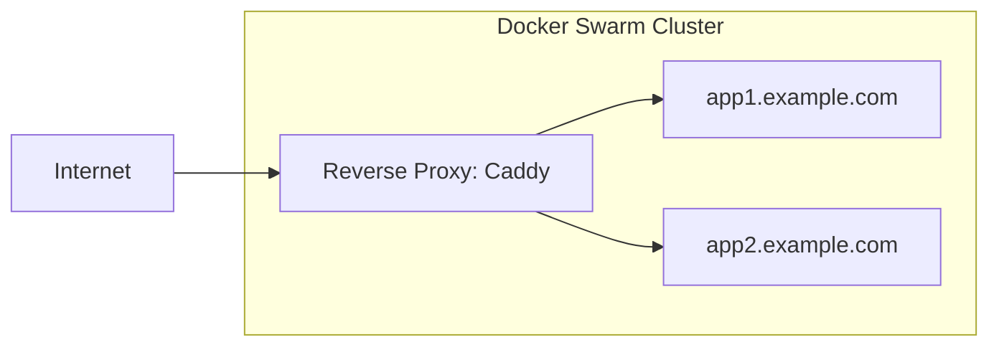

# Deploying Yii applications to Docker Swarm and Caddy

This guide walks you through deploying a Yii application to [Docker Swarm](https://docs.docker.com/engine/swarm/)
starting from a blank server, using [Caddy](https://caddyserver.com/) as
a reverse proxy and deploying from a container registry ([Forgejo](https://forgejo.org/) or [Gitea](https://about.gitea.com/)).



## Prerequisites

- A server with a fresh installation of a Linux distribution (Ubuntu 22.04 LTS or later recommended)
- A domain name pointing to your server's IP address
- SSH access to your server
- Basic knowledge of Docker and command-line tools

## Server preparation

### Install Docker

For installation instructions, see the [official Docker documentation](https://docs.docker.com/engine/install/ubuntu/).

### Initialize Docker Swarm

Initialize your server as a Docker Swarm manager:

```bash
docker swarm init --advertise-addr <YOUR_SERVER_IP>
```

Replace `<YOUR_SERVER_IP>` with your server's public IP address.

### Set up the reverse proxy network

Create a dedicated overlay network for reverse proxy to communicate with your services:

```bash
docker network create --driver=overlay reverse_proxy_public
```

## Setting up Caddy as reverse proxy

To deploy Caddy as reverse proxy create a file `caddy-stack.yml`:

```yaml
services:
  caddy:
    image: lucaslorentz/caddy-docker-proxy:ci-alpine
    ports:
      - "80:80"
      - "443:443"
    volumes:
      - /var/run/docker.sock:/var/run/docker.sock
      - caddy_data:/data
    networks:
      - reverse_proxy_public

volumes:
  caddy_data:

networks:
  reverse_proxy_public:
    external: true
```

Deploy Caddy:

```bash
docker stack deploy -c caddy-stack.yml caddy
```

Caddy automatically discovers services with Caddy labels and sets up HTTPS using Let's Encrypt. Yii3 application
templates are using Caddy labels by default:

```yaml
deploy:
    labels:
      - caddy: ${PROD_HOST:-app.example.com}
      - caddy.reverse_proxy: "{{upstreams 80}}"
```

> [!IMPORTANT]
> Make sure your domain DNS records are configured and pointing to your server before deploying services with
> Caddy labels, as Let's Encrypt requires domain validation.

## Setting up a container registry

You need a container registry to store your Docker images. Choose one of the following options.

### Option 1: Using Forgejo

To deploy Forgejo create a file `forgejo-stack.yml`:

```yaml
services:
  forgejo:
    image: codeberg.org/forgejo/forgejo:1.21
    ports:
      - "3000:3000"
    volumes:
      - forgejo_data:/data
    networks:
      - reverse_proxy_public
    deploy:
      labels:
        - "caddy=git.example.com"
        - "caddy.reverse_proxy={{upstreams 3000}}"

volumes:
  forgejo_data:

networks:
  reverse_proxy_public:
    external: true
```

Deploy Forgejo:

```bash
docker stack deploy -c forgejo-stack.yml forgejo
```

Replace `git.example.com` with your desired subdomain.

After deployment, access Forgejo at `https://git.example.com` and complete the initial setup. Make sure to enable the container registry in the settings.

### Option 2: Using Gitea

To deploy Gitea create a file `gitea-stack.yml`:

```yaml
services:
  gitea:
    image: gitea/gitea:latest
    ports:
      - "3000:3000"
    volumes:
      - gitea_data:/data
    networks:
      - reverse_proxy_public
    deploy:
      labels:
        - "caddy=git.example.com"
        - "caddy.reverse_proxy={{upstreams 3000}}"

volumes:
  gitea_data:

networks:
  reverse_proxy_public:
    external: true
```

Deploy Gitea:

```bash
docker stack deploy -c gitea-stack.yml gitea
```

Replace `git.example.com` with your desired subdomain.

After deployment, access Gitea at `https://git.example.com` and complete the initial setup. 
Make sure to enable the container registry in the settings.

## Configuring your Yii application

### Update the Makefile configuration

The [Yii application template](https://github.com/yiisoft/app) includes a Makefile with deployment commands. Update the `docker/.env` file in your project:

```bash
STACK_NAME=myapp

#
# Production
#

PROD_HOST=app.example.com
PROD_SSH="ssh://user@your-server-ip"

IMAGE=git.example.com/username/myapp
IMAGE_TAG=latest
```

Replace the values:
- `STACK_NAME`: A unique name for your application stack
- `PROD_HOST`: The domain name where your app will be accessible
- `PROD_SSH`: SSH connection string to your server (format: `ssh://user@host`)
- `IMAGE`: Full path to your container image in the registry
- `IMAGE_TAG`: Image tag, typically `latest` or a version number

### Configure the production environment

Update `docker/prod/.env` with your production environment variables:

```bash
APP_ENV=prod
YII_DEBUG=false
YII_ENV=prod

# Database configuration
DB_HOST=db
DB_NAME=myapp
DB_USER=myapp
DB_PASSWORD=secure_password_here

# Add other environment-specific variables
```

> [!WARNING]
> Never commit sensitive credentials to version control. Use `docker/prod/override.env` for sensitive values and add it to `.gitignore`.

### Review the production Docker Compose configuration

The default `docker/prod/compose.yml` includes:

```yaml
services:
  app:
    image: ${IMAGE}:${IMAGE_TAG}
    networks:
      - reverse_proxy_public
    volumes:
      - runtime:/app/runtime
      - caddy_data:/data
      - caddy_config:/config
    env_file:
      - path: ./prod/.env
      - path: ./prod/override.env
        required: false\
    environment:
      CADDY_EXTRA_CONFIG: 'auto_https off'
    deploy:
      replicas: 2
      update_config:
        delay: 10s
        parallelism: 1
        order: start-first
        failure_action: rollback
        monitor: 10s
      rollback_config:
        parallelism: 0
        order: stop-first
      restart_policy:
        condition: on-failure
        delay: 5s
        max_attempts: 3
        window: 120s
      labels:
        caddy: ${PROD_HOST:-app.example.com}
        caddy.reverse_proxy: "{{upstreams 80}}"
```

This configuration:
- Runs 2 replicas for high availability
- Uses a rolling update strategy with automatic rollback on failure
- Configures `labels` for automatic HTTPS on the reverse proxy
- Disables obtaining of HTTPs certificates on the container itself
  since proxy communicates with the container via HTTP. That is `auto_https off`.

If you need a database, add it to the stack:

```yaml
services:
  app:
    # ... existing configuration ...
    
  db:
    image: postgres:15-alpine
    environment:
      POSTGRES_DB: myapp
      POSTGRES_USER: myapp
      POSTGRES_PASSWORD_FILE: /run/secrets/db_password
    volumes:
      - db_data:/var/lib/postgresql/data
    networks:
      - reverse_proxy_public
    deploy:
      placement:
        constraints:
          - node.role == manager
    secrets:
      - db_password

volumes:
  runtime:
  db_data:

secrets:
  db_password:
    external: true
```

Create the database password secret on the server:

```bash
echo "your_secure_password" | docker secret create db_password -
```

## Building and pushing the image

### Set up Docker login on your local machine

Configure Docker to authenticate with your container registry:

```bash
docker login git.example.com
```

Enter your username and password when prompted.

### Build the production image

Use the Makefile to build your production image:

```bash
make prod-build
```

This runs the command defined in the Makefile:

```bash
docker build --file docker/Dockerfile --target prod --pull -t ${IMAGE}:${IMAGE_TAG} .
```

The Dockerfile uses a multi-stage build:
1. Installs Composer dependencies in a builder stage
2. Creates a minimal production image with only the necessary files
3. Runs as a non-root user (`www-data`)

### Push the image to the registry

Push your built image to the container registry:

```bash
make prod-push
```

This executes:

```bash
docker push ${IMAGE}:${IMAGE_TAG}
```

## Deploying to Docker Swarm

### Configure SSH access

Set up SSH key-based authentication to your server:

```bash
# Generate SSH key (if you don't have one)
ssh-keygen -t ed25519 -C "your_email@example.com"

# Copy the key to your server
ssh-copy-id user@your-server-ip

# Add the SSH host to your SSH config (~/.ssh/config)
cat >> ~/.ssh/config << EOF
Host docker-web
    HostName your-server-ip
    User user
    IdentityFile ~/.ssh/id_ed25519
EOF
```

### Set up Docker context

Create a Docker context for remote deployment:

```bash
docker context create swarm-prod --docker "host=ssh://docker-web"
```

Alternatively, configure the `DOCKER_HOST` environment variable:

```bash
export DOCKER_HOST=ssh://docker-web
```

### Deploy the application

Deploy your application stack to Docker Swarm:

```bash
make prod-deploy
```

This executes:

```bash
docker -H ${PROD_SSH} stack deploy --prune --detach=false --with-registry-auth -c docker/compose.yml -c docker/prod/compose.yml ${STACK_NAME}
```

The `--with-registry-auth` flag ensures the Swarm nodes can pull images from your private registry.

### Verify the deployment

Check the status of your services:

```bash
docker -H ssh://docker-web service ls
docker -H ssh://docker-web service ps ${STACK_NAME}_app
```

View logs:

```bash
docker -H ssh://docker-web service logs ${STACK_NAME}_app
```

## Monitoring and maintenance

### View service logs

```bash
# View all logs
docker -H ssh://docker-web service logs -f ${STACK_NAME}_app

# View logs from the last 100 lines
docker -H ssh://docker-web service logs --tail 100 ${STACK_NAME}_app

# View logs with timestamps
docker -H ssh://docker-web service logs -t ${STACK_NAME}_app
```

### Scale the application

Adjust the number of replicas:

```bash
docker -H ssh://docker-web service scale ${STACK_NAME}_app=3
```

Or update the `replicas` value in `docker/prod/compose.yml` and redeploy.

### Resource limits

Add resource limits to prevent containers from consuming all server resources. Update `docker/prod/compose.yml`:

```yaml
services:
  app:
    # ... existing configuration ...
    deploy:
      resources:
        limits:
          cpus: '0.5'
          memory: 512M
        reservations:
          cpus: '0.25'
          memory: 256M
```

## Security considerations

### Use Docker secrets for sensitive data

Instead of environment variables, use Docker secrets for sensitive information:

```bash
# Create secrets
echo "database_password" | docker secret create db_password -
echo "api_key" | docker secret create api_key -
```

Update `docker/prod/compose.yml`:

```yaml
services:
  app:
    secrets:
      - db_password
      - api_key

secrets:
  db_password:
    external: true
  api_key:
    external: true
```

Access secrets in your application at `/run/secrets/secret_name`.

### Set up a firewall

Configure UFW (Uncomplicated Firewall) on your server:

```bash
# Allow SSH
sudo ufw allow 22/tcp

# Allow HTTP and HTTPS
sudo ufw allow 80/tcp
sudo ufw allow 443/tcp

# Allow Docker Swarm ports (if you plan to add more nodes)
sudo ufw allow 2377/tcp
sudo ufw allow 7946/tcp
sudo ufw allow 7946/udp
sudo ufw allow 4789/udp

# Enable the firewall
sudo ufw enable
```

### Keep the system updated

Regularly update your server and Docker:

```bash
# Update system packages
sudo apt-get update && sudo apt-get upgrade -y

# Update Docker images
docker -H ssh://docker-web service update --image ${IMAGE}:${IMAGE_TAG} ${STACK_NAME}_app
```

## Troubleshooting

### Service won't start

Check service events and logs:

```bash
docker -H ssh://docker-web service ps ${STACK_NAME}_app --no-trunc
docker -H ssh://docker-web service logs ${STACK_NAME}_app
```

Common issues:
- **Image pull errors**: Verify registry authentication with `docker -H ssh://docker-web login`
- **Port conflicts**: Ensure no other services are using ports 80/443
- **Resource constraints**: Check available resources with `docker -H ssh://docker-web node ls`

### SSL certificate issues

If Caddy can't obtain certificates:
- Verify DNS is pointing to your server
- Check that ports 80 and 443 are accessible from the internet
- Ensure the email in the Let's Encrypt configuration is valid
- Check logs: `docker -H ssh://docker-web service logs caddy`

### Container registry connection issues

Test registry connectivity:

```bash
# From your local machine
docker pull git.example.com/username/myapp:latest

# From the server
docker -H ssh://docker-web pull git.example.com/username/myapp:latest
```

## Summary

You've successfully deployed a Yii application to Docker Swarm with:
- A container registry (Forgejo or Gitea)
- Automatic HTTPS via Caddy
- Zero-downtime deployments with rolling updates
- High availability with multiple replicas

The Makefile commands simplify the deployment workflow:
- `make prod-build` - Build the production image
- `make prod-push` - Push to the registry
- `make prod-deploy` - Deploy to Docker Swarm

For more information, see:
- [Yii Application Template](https://github.com/yiisoft/app)
- [Docker Swarm Documentation](https://docs.docker.com/engine/swarm/)
- [Caddy Docker Proxy](https://github.com/lucaslorentz/caddy-docker-proxy)
