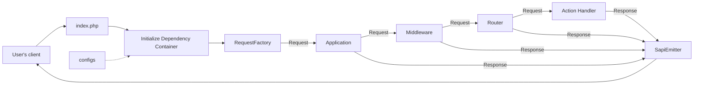

# Running applications

After installing Yii, you have a working Yii application.
This section introduces the application's built-in functionality,
how the code is organized, and how the application handles requests in general.

Note that unlike the framework itself, after you install a project template, it's all yours.
You're free to add or delete code and overall change it as you need.

## Functionality <span id="functionality"></span>

The installed application contains only one page, accessible at `http://localhost/`.
It shares a common layout that you can reuse on further pages.

<!--
You should also see a toolbar at the bottom of the browser window.
This is useful [debugger tool](https://github.com/yiisoft/yii-debug) provided by Yii to record and display a lot of
debugging information, such as log messages, response statuses, the database queries run, and so on.
-->

In addition to the web application, you can access a console script via `APP_ENV=dev ./yii` or, in case of Docker, `make yii`.
Use this script to run background and maintenance tasks for the application, which the
[Console Application Section](../tutorial/console-applications.md) describes.


## Application structure <span id="application-structure"></span>

The most important directories and files in your application are (assuming the application's root directory is `app`):

```
assets/                 Asset bundle source files.
config/                 Configuration files.
    common/             Common configuration and DI definitions.
    console/            Console-specific configuration.
    environments/       Environment-specific configuration (dev/test/prod).
    web/                Web-specific configuration.
docker/                 Docker-specific files.
public/                 Files publically accessible from the Internet.
    assets/             Published/compiled assets.
    index.php           Entry script.
runtime/                Files generated during runtime.
src/                    Application source code.
    Console/            Console commands.
    Shared/             Code shared between web and console applications.
    Web/                Web-specific code (actions, handlers, layout).
        Shared/         Shared web components.
            Layout/     Layout components and templates.
    Environment.php     Environment configuration class.
tests/                  A set of Codeception tests for the application.
    Console/            Console command tests.
    Functional/         Functional tests.
    Unit/               Unit tests.
    Web/                Web actions tests.
vendor/                 Installed Composer packages.
Makefile                Config for make command.
yii                     Console application entry point.
```

In general, the files in the application fall into two groups: those under `app/public` and those
under other directories. You can access the former directly via HTTP (i.e., in a browser), while you shouldn't expose the latter.

Each application has an entry script `public/index.php`, the only web-accessible PHP script in the application.
The entry script uses an [application runner](https://github.com/yiisoft/yii-runner) to create an instance of
an incoming request with the help of one of PSR-7 packages and passes it to an [application](../structure/application.md)
instance. The application executes a set of middleware sequentially to process the request.
It then passes the result to the emitter, which sends the response to the browser.

Depending on the middleware you use, the application may behave differently. By default, a router
uses the requested URL and configuration to choose a handler and execute it to produce a response.

You can learn more about the application template from
the [yiisoft/app package documentation](https://github.com/yiisoft/app/blob/master/README.md).

## Request Lifecycle <span id="request-lifecycle"></span>

The following diagram shows how an application handles a request.



1. A user makes a request to the [entry script](../structure/entry-script.md) `public/index.php`.
2. The entry script with the help of the application runner loads
   the container [configuration](../concept/configuration.md) and creates
   an [application](../structure/application.md) instance and services necessary to handle the request.
3. Request factory creates a request object based on a raw request that came from a user.
4. Application passes a request object through a middleware array configured. One of these is typically a router.
5. The Router finds out what handler to execute based on request and configuration.
6. The handler may load some data, possibly from a database.
7. The handler forms a response by using data. Either directly or with the help of the view package.
8. Emitter receives the response and takes care of sending the response to the user's browser.
