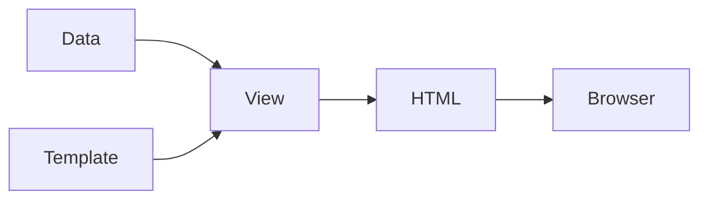

# Views

View is responsible for presenting data to end users. You give it a template with some placeholders and presentation
logic and some data. The view is passing data to the template executing template logic. The end result is
ready to be passed to end user, be it a browser, a file to download, an email to send or something else.



In Yii3 views are typically PHP files that contain presentation logic and HTML markup. The view system provides
a flexible way to organize your presentation layer and supports features like layouts and partial views. Instead of
using plain PHP templates, you can leverage [one of the template engines such as Twig](template-engines.md).

## Installation

For basic view functionality, you need the `yiisoft/view` package:

```sh
composer require yiisoft/view
```

For web applications, you should also install the `yiisoft/yii-view-renderer` package which provides
[PSR-7](https://www.php-fig.org/psr/psr-7/) compatibility and web-specific features:

```sh
composer require yiisoft/yii-view-renderer
```

These packages are included by default in the `yiisoft/app` application template.

## Basic Concepts

A view template file contains presentation logic. 
In the `yiisoft/app` template, view files are typically stored alongside their controllers
(e.g., `src/Web/Echo/Action.php`). Here's a simple view file example, `src/Web/Echo/template.php`:

```php
<?php
use Yiisoft\Html\Html;
/* @var string $message */
?>

<p>The message is: <?= Html::encode($message) ?></p>
```

Here `$message` is a view data that is passed when you render a template with the help of  `ViewRenderer`. For
example, `src/Web/Echo/Action.php`:

```php
<?php

declare(strict_types=1);

namespace App\Web\Echo;

use Psr\Http\Message\ResponseInterface;
use Yiisoft\Router\HydratorAttribute\RouteArgument;
use Yiisoft\Yii\View\Renderer\ViewRenderer;

final readonly class Action
{
    public function __construct(
        private ViewRenderer $viewRenderer,
    ) {}

    public function __invoke(
        #[RouteArgument('message')]
        string $message = 'Hello!'
    ): ResponseInterface
    {
        return $this->viewRenderer->render(__DIR__ . '/template', [
            'message' => $message,
        ]);
    }
}
```

First argument of the `render()` method is a path to the template file. In the `yiisoft/app`, template files
are typically stored alongside their actions. The result is ready to be rendered to the browser so we return it
immediately.

## Working with layouts

Most web applications use a common layout for all pages. In the `yiisoft/app` template,
layouts are stored in `src/Web/Shared/Layout/Main/` directory. You can set a default layout in `config/common/params.php`:

```php
return [
    'yiisoft/yii-view-renderer' => [
        'viewPath' => null,
        'layout' => '@src/Web/Shared/Layout/Main/layout.php',
    ],
];
```

A typical layout file such as `src/Web/Shared/Layout/Main/layout.php` looks like this:

```php
<?php

declare(strict_types=1);

use App\Web\Shared\Layout\Main\MainAsset;
use Yiisoft\Html\Html;

/**
 * @var \App\Shared\ApplicationParams $applicationParams
 * @var Yiisoft\Aliases\Aliases $aliases
 * @var Yiisoft\Assets\AssetManager $assetManager
 * @var string $content
 * @var string|null $csrf
 * @var Yiisoft\View\WebView $this
 * @var Yiisoft\Router\CurrentRoute $currentRoute
 * @var Yiisoft\Router\UrlGeneratorInterface $urlGenerator
 */

$assetManager->register(MainAsset::class);

$this->addCssFiles($assetManager->getCssFiles());
$this->addCssStrings($assetManager->getCssStrings());
$this->addJsFiles($assetManager->getJsFiles());
$this->addJsStrings($assetManager->getJsStrings());
$this->addJsVars($assetManager->getJsVars());

$this->beginPage()
?>
<!DOCTYPE html>
<html lang="<?= Html::encode($applicationParams->locale) ?>">
<head>
    <meta charset="<?= Html::encode($applicationParams->charset) ?>">
    <meta name="viewport" content="width=device-width, initial-scale=1">
    <link rel="icon" href="<?= $aliases->get('@baseUrl/favicon.svg') ?>" type="image/svg+xml">
    <title><?= Html::encode($this->getTitle()) ?></title>
    <?php $this->head() ?>
</head>
<body>
<?php $this->beginBody() ?>

<div class="header">
    <a href="/">
        <?= Html::encode($applicationParams->name) ?>
    </a>
</div>

<div class="content">    
    <?= $content ?>
</div>

<div class="footer">
    © <?= date('Y') ?>  <?= Html::encode($applicationParams->name) ?>    
</div>

<?php $this->endBody() ?>
</body>
</html>
<?php $this->endPage() ?>
```

In the template above `$applicationParams` is an array of parameters from `config/common/application.php`. 

`$aliases` refers to [aliases component](../concept/aliases.md) that is used to get the base URL of
the application at the server for URLs. 

`$this` is an instance of the view that we use to get page title and output assets. Both standard and custom. 

With `$assetManager->register(MainAsset::class);` we register an asset that defines `css` to include to the page. It is
automatically copied to `public/assets` on first use. It is not very useful for a single CSS file but becomes handy as
the number of assets grows.

> [!IMPORTANT]
> No output in plain PHP templates is encoded you should not forget to use `Html::encode()` to prevent
XSS security vulnerabilities.

More about what's available in layout could be read in [yiisoft/view](https://github.com/yiisoft/view) documentation.

### Rendering without layout

Sometimes you need to render a view without a layout (for example, for AJAX responses):

```php
public function ajaxContent(): ResponseInterface
{
    return $this->viewRenderer
        ->withLayout(null)
        ->render('ajax-content', ['data' => $data]);
}

// Or use the renderPartial method
public function ajaxContent(): ResponseInterface
{
    return $this->viewRenderer->renderPartial('ajax-content', ['data' => $data]);
}
```

## Nested Views and Partials

### Rendering Sub-views

You can render other views from within a view using the `$this->render()` method:

```php
<?php

declare(strict_types=1);

/**
 * @var \Yiisoft\View\WebView $this
 * @var \App\Entity\Post[] $posts
 */
?>
<div class="posts">
    <?php foreach ($posts as $post): ?>
        <?= $this->render('_post_item', ['post' => $post]) ?>
    <?php endforeach; ?>
</div>
```

**src/Web/Post/_item.php**
```php
<?php

declare(strict_types=1);

use Yiisoft\Html\Html;

/**
 * @var \Yiisoft\View\WebView $this
 * @var \App\Entity\Post $post
 */
?>
<article class="post">
    <h2><?= Html::encode($post->getTitle()) ?></h2>
    <p><?= Html::encode($post->getExcerpt()) ?></p>
    <time><?= $post->getCreatedAt()->format('Y-m-d') ?></time>
</article>
```

### Using Blocks

Blocks allow you to define content in one view and display it in another, typically in layouts:

```php
// In a view file
<?php $this->setBlock('sidebar', $this->render('_sidebar', ['items' => $sidebarItems])) ?>

// In the layout file
<?php if ($this->hasBlock('sidebar')): ?>
    <aside><?= $this->getBlock('sidebar') ?></aside>
<?php endif ?>
```

## Rendering as String

If you need the rendered content as a string instead of a PSR-7 response:

```php
public function getEmailContent(): string
{
    return $this->viewRenderer->renderAsString('email/welcome', [
        'user' => $user,
    ]);
}
```

## View Events

The view system triggers events during the rendering process that you can listen to:

```php
use Yiisoft\View\Event\WebView\BeforeRender;
use Yiisoft\View\Event\WebView\AfterRender;

// Example event listener
final class ViewEventListener
{
    public function onBeforeRender(BeforeRender $event): void
    {
        // Add global CSS class based on view name
        if (str_contains($event->getFile(), 'admin/')) {
            $event->getView()->registerCssClass('admin-view');
        }
    }

    public function onAfterRender(AfterRender $event): void
    {
        // Log rendering time
        $this->logger->info('View rendered', [
            'view' => $event->getFile(),
            'time' => $event->getRenderTime(),
        ]);
    }
}
```
