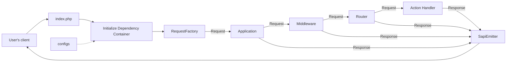

# Запуск приложений

После установки Yii у вас будет работающее приложение Yii. В этом разделе
описывается встроенная функциональность приложения, организация кода, а
также общий процесс обработки запросов.

Обратите внимание, что в отличие от самого фреймворка, после установки
шаблона проекта он полностью принадлежит вам. Вы можете свободно добавлять
или удалять код и в целом изменять его в соответствии с вашими
потребностями.

## Функциональность <span id="functionality"></span>

Установленное приложение содержит только одну страницу, доступную по адресу
`http://localhost/`. Она использует общий макет, который можно повторно
использовать на других страницах.

<!--
Вы также должны увидеть панель инструментов в нижней части окна браузера.
Это полезный [инструмент отладки](https://github.com/yiisoft/yii-debug), предоставляемый Yii, который позволяет
записывать и отображать большое количество отладочной информации, такой как сообщения журнала, статусы ответов,
выполненные запросы к базе данных и многое другое.
-->

Помимо веб-приложения, вы можете получить доступ к консольному скрипту с
помощью `APP_ENV=dev ./yii` или, в случае использования Docker, `make
yii`. Этот скрипт используется для запуска фоновых и обслуживающих задач
приложения, что описано в разделе [Консольное
приложение](../tutorial/console-applications.md).


## Структура приложения <span id="application-structure"></span>

Наиболее важные каталоги и файлы приложения (предполагается, что корневым
каталогом приложения является `app`):

```
assets/                 Исходные файлы наборов ресурсов.
config/                 Файлы конфигурации.
    common/             Общая конфигурация и определения DI.
    console/            Конфигурация для консольного приложения.
    environments/       Конфигурация для различных окружений (dev/test/prod).
    web/                Конфигурация для веб-приложения.
docker/                 Файлы, специфичные для Docker.
public/                 Файлы, доступные из интернета.
    assets/             Опубликованные/скомпилированные ресурсы.
    index.php           Входной скрипт.
runtime/                Файлы, создаваемые во время выполнения.
src/                    Исходный код приложения.
    Console/            Консольные команды.
    Shared/             Код, общий для веб- и консольного приложений.
    Web/                Код, специфичный для веб-приложения (действия, обработчики, макеты).
        Shared/         Общие веб-компоненты.
            Layout/     Компоненты и шаблоны макетов.
    Environment.php     Класс конфигурации окружения.
tests/                  Набор тестов Codeception для приложения.
    Console/            Тесты консольных команд.
    Functional/         Функциональные тесты.
    Unit/               Модульные тесты.
    Web/                Тесты веб-действий.
vendor/                 Установленные пакеты Composer.
Makefile                Конфигурация для команды make.
yii                     Точка входа консольного приложения.
```

В целом файлы приложения можно разделить на две группы: находящиеся в
`app/public` и расположенные в других каталогах. К первым можно получить
прямой доступ по HTTP (например, через браузер), тогда как вторые не следует
делать доступными извне.

Каждое приложение имеет входной скрипт `public/index.php` — единственный
PHP-скрипт приложения, доступный через веб. Входной скрипт с помощью
[application runner](https://github.com/yiisoft/yii-runner) создает
экземпляр входящего запроса с использованием одного из пакетов PSR-7 и
передает его экземпляру
[приложения](../structure/application.md). Приложение последовательно
выполняет набор middleware для обработки запроса, после чего передает
результат эмиттеру, который отправляет ответ в браузер.

В зависимости от используемых middleware поведение приложения может
различаться. По умолчанию маршрутизатор использует запрошенный URL и
конфигурацию для выбора обработчика и его выполнения с целью формирования
ответа.

Дополнительную информацию о шаблоне приложения можно найти в [документации
пакета yiisoft/app](https://github.com/yiisoft/app/blob/master/README.md).

## Жизненный цикл запроса <span id="request-lifecycle"></span>

Следующая диаграмма показывает, как приложение обрабатывает запрос.



1. Пользователь отправляет запрос во [входной
   скрипт](../structure/entry-script.md) `public/index.php`.
2. Входной скрипт с помощью application runner загружает
   [конфигурацию](../concept/configuration.md) контейнера и создает
   экземпляр [приложения](../structure/application.md), а также сервисы,
   необходимые для обработки запроса.
3. Фабрика запросов создает объект запроса на основе необработанного
   запроса, полученного от пользователя.
4. Приложение передает объект запроса через настроенный набор
   middleware. Одним из них, как правило, является маршрутизатор.
5. Маршрутизатор определяет, какой обработчик следует выполнить, на основе
   запроса и конфигурации.
6. Обработчик может загрузить данные, например из базы данных.
7. Обработчик формирует ответ, используя данные — либо напрямую, либо с
   помощью пакета представлений.
8. Эмиттер получает ответ и отвечает за его отправку в браузер пользователя.
