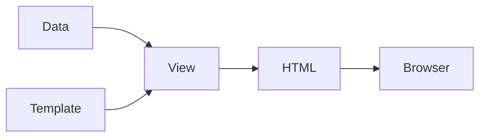

# 视图

视图负责向最终用户呈现数据。您为其提供一个包含一些占位符、表示逻辑和数据的模板。视图将数据传递给模板，执行模板逻辑。最终结果准备好传递给最终用户，无论是浏览器、要下载的文件、要发送的电子邮件还是其他内容。



在 Yii3 中，视图通常是包含表示逻辑和 HTML 标记的 PHP
文件。视图系统提供了一种灵活的方式来组织您的表示层，并支持布局和局部视图等功能。除了使用纯 PHP 模板，您还可以利用模板引擎，例如
[Twig](template-engines.md) 或 [Blade](https://github.com/lee-to/yii-blade)。

## 安装

对于基本的视图功能，您需要 `yiisoft/view` 包：

```sh
composer require yiisoft/view
```

对于 Web 应用程序，您还应该安装 `yiisoft/yii-view-renderer` 包，它提供
[PSR-7](https://www.php-fig.org/psr/psr-7/) 兼容性和 Web 特定功能：

```sh
composer require yiisoft/yii-view-renderer
```

这些包默认包含在 `yiisoft/app` 应用程序模板中。

## 基本概念

视图模板文件包含表示逻辑。在 `yiisoft/app`
模板中，视图文件通常与它们的控制器存储在一起（例如，`src/Web/Echo/Action.php`）。这是一个简单的视图文件示例，`src/Web/Echo/template.php`：

```php
<?php
use Yiisoft\Html\Html;
/* @var string $message */
?>

<p>The message is: <?= Html::encode($message) ?></p>
```

这里 `$message` 是通过 `WebViewRenderer`
渲染模板时传递的视图数据。例如，`src/Web/Echo/Action.php`：

```php
<?php

declare(strict_types=1);

namespace App\Web\Echo;

use Psr\Http\Message\ResponseInterface;
use Yiisoft\Router\HydratorAttribute\RouteArgument;
use Yiisoft\Yii\View\Renderer\WebViewRenderer;

final readonly class Action
{
    public function __construct(
        private WebViewRenderer $viewRenderer,
    ) {}

    public function __invoke(
        #[RouteArgument('message')]
        string $message = 'Hello!'
    ): ResponseInterface
    {
        return $this->viewRenderer->render(__DIR__ . '/template', [
            'message' => $message,
        ]);
    }
}
```

`render()` 方法的第一个参数是模板文件的路径。在 `yiisoft/app`
中，模板文件通常与其操作一起存储。结果已准备好渲染到浏览器，因此我们立即返回它。

## 使用布局

大多数 Web 应用程序为所有页面使用通用布局。在 `yiisoft/app` 模板中，布局存储在
`src/Web/Shared/Layout/Main/` 目录中。您可以在 `config/common/params.php` 中设置默认布局：

```php
return [
    'yiisoft/yii-view-renderer' => [
        'viewPath' => null,
        'layout' => '@src/Web/Shared/Layout/Main/layout.php',
    ],
];
```

典型的布局文件，例如 `src/Web/Shared/Layout/Main/layout.php`，如下所示：

```php
<?php

declare(strict_types=1);

use App\Web\Shared\Layout\Main\MainAsset;
use Yiisoft\Html\Html;

/**
 * @var \App\Shared\ApplicationParams $applicationParams
 * @var Yiisoft\Aliases\Aliases $aliases
 * @var Yiisoft\Assets\AssetManager $assetManager
 * @var string $content
 * @var string|null $csrf
 * @var Yiisoft\View\WebView $this
 * @var Yiisoft\Router\CurrentRoute $currentRoute
 * @var Yiisoft\Router\UrlGeneratorInterface $urlGenerator
 */

$assetManager->register(MainAsset::class);

$this->addCssFiles($assetManager->getCssFiles());
$this->addCssStrings($assetManager->getCssStrings());
$this->addJsFiles($assetManager->getJsFiles());
$this->addJsStrings($assetManager->getJsStrings());
$this->addJsVars($assetManager->getJsVars());

$this->beginPage()
?>
<!DOCTYPE html>
<html lang="<?= Html::encode($applicationParams->locale) ?>">
<head>
    <meta charset="<?= Html::encode($applicationParams->charset) ?>">
    <meta name="viewport" content="width=device-width, initial-scale=1">
    <link rel="icon" href="<?= $aliases->get('@baseUrl/favicon.svg') ?>" type="image/svg+xml">
    <title><?= Html::encode($this->getTitle()) ?></title>
    <?php $this->head() ?>
</head>
<body>
<?php $this->beginBody() ?>

<div class="header">
    <a href="/">
        <?= Html::encode($applicationParams->name) ?>
    </a>
</div>

<div class="content">    
    <?= $content ?>
</div>

<div class="footer">
    © <?= date('Y') ?>  <?= Html::encode($applicationParams->name) ?>    
</div>

<?php $this->endBody() ?>
</body>
</html>
<?php $this->endPage() ?>
```

在上面的模板中，`$applicationParams` 是来自 `config/common/application.php` 的参数数组。

`$aliases` 指的是[别名组件](../concept/aliases.md)，用于获取服务器上应用程序的基础 URL。

`$this` 是视图的实例，我们用它来获取页面标题和输出资源，包括标准的和自定义的。

使用 `$assetManager->register(MainAsset::class);` 我们注册一个资源，定义要包含在页面中的 `css`。它在
首次使用时会自动复制到 `public/assets`。对于单个 CSS 文件来说用处不大，但随着
资源数量的增加，它会变得很方便。

> [!IMPORTANT]
> 纯 PHP 模板中的输出不会被编码，您不应忘记使用 `Html::encode()` 来防止
XSS 安全漏洞。

更多关于布局中可用内容的信息可以在 [yiisoft/view](https://github.com/yiisoft/view) 文档中阅读。

### 不使用布局渲染

有时您需要渲染没有布局的视图（例如，对于 AJAX 响应）：

```php
public function ajaxContent(): ResponseInterface
{
    return $this->viewRenderer
        ->withLayout(null)
        ->render('ajax-content', ['data' => $data]);
}

// Or use the renderPartial method
public function ajaxContent(): ResponseInterface
{
    return $this->viewRenderer->renderPartial('ajax-content', ['data' => $data]);
}
```

## 嵌套视图和局部视图

### 渲染子视图

您可以使用 `$this->render()` 方法从视图中渲染其他视图：

```php
<?php

declare(strict_types=1);

/**
 * @var \Yiisoft\View\WebView $this
 * @var \App\Entity\Post[] $posts
 */
?>
<div class="posts">
    <?php foreach ($posts as $post): ?>
        <?= $this->render('_post_item', ['post' => $post]) ?>
    <?php endforeach; ?>
</div>
```

**src/Web/Post/_item.php**
```php
<?php

declare(strict_types=1);

use Yiisoft\Html\Html;

/**
 * @var \Yiisoft\View\WebView $this
 * @var \App\Entity\Post $post
 */
?>
<article class="post">
    <h2><?= Html::encode($post->getTitle()) ?></h2>
    <p><?= Html::encode($post->getExcerpt()) ?></p>
    <time><?= $post->getCreatedAt()->format('Y-m-d') ?></time>
</article>
```

### 使用块

块允许您在一个视图中定义内容，并在另一个视图（通常是布局）中显示它：

```php
// In a view file
<?php $this->setBlock('sidebar', $this->render('_sidebar', ['items' => $sidebarItems])) ?>

// In the layout file
<?php if ($this->hasBlock('sidebar')): ?>
    <aside><?= $this->getBlock('sidebar') ?></aside>
<?php endif ?>
```

## 渲染为字符串

如果您需要将渲染内容作为字符串而不是 PSR-7 响应：

```php
public function getEmailContent(): string
{
    return $this->viewRenderer->renderAsString('email/welcome', [
        'user' => $user,
    ]);
}
```

## 视图事件

视图系统在渲染过程中触发您可以监听的事件：

```php
use Yiisoft\View\Event\WebView\BeforeRender;
use Yiisoft\View\Event\WebView\AfterRender;

// Example event listener
final class ViewEventListener
{
    public function onBeforeRender(BeforeRender $event): void
    {
        // Add global CSS class based on view name
        if (str_contains($event->getFile(), 'admin/')) {
            $event->getView()->registerCssClass('admin-view');
        }
    }

    public function onAfterRender(AfterRender $event): void
    {
        // Log rendering time
        $this->logger->info('View rendered', [
            'view' => $event->getFile(),
            'time' => $event->getRenderTime(),
        ]);
    }
}
```
